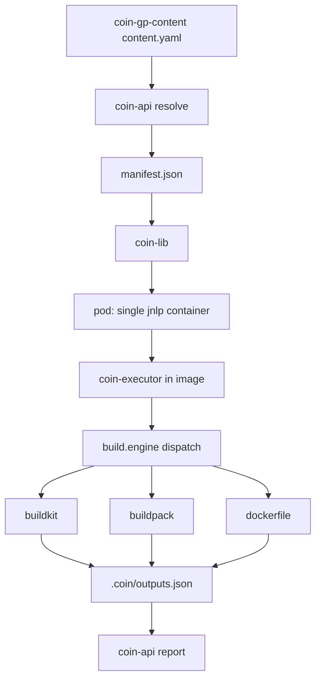

# Build Engine Model

## Решение

Hard cut build-модели Coin без migration dual path.

```yaml
# coin-gp-content/stacks/<gp>/content.yaml
build:
  engine: buildpack | buildkit | dockerfile
```

| Слой | Роль |
|------|------|
| `coin-gp-content` | SoT: build policy, Containerfile/buildpack assets, schema |
| `coin-api` | resolve → manifest с `build`, `runtime.image`, typed `pipeline.stages` |
| `coin-executor` | validate/test/build/publish + engine dispatch |
| `coin-lib` | Jenkins glue: resolve, pod, creds, вызов executor stages |
| `coin-executor/Dockerfile.agent` | единственный runtime agent image |

## Hard Cut

Сразу перестраиваем, без совместимости со старой моделью:

- нет language-specific stack agents;
- нет GP `scripts/*.sh` в runtime path;
- нет dual-container pod (`jnlp` + `stack`);
- нет `manifest.jnlp`;
- нет `/var/run/docker.sock` по умолчанию;
- нет bootstrap `curl coin-executor` — binary уже в agent image;
- нет project-level `build.engine` override.

Единственный explicit escape hatch: engine `dockerfile` внутри нового `build.engine` контракта (не legacy path вне контракта).

## Устранённые Противоречия

| Было | Стало |
|------|-------|
| GP `dockerfiles/Containerfile`, manifest `.coin/Dockerfile` | GP хранит artifact `dockerfiles/Containerfile`; executor materialize в `.coin/Containerfile`; manifest содержит resolved path |
| `deliverables.*.build` в project config | build policy только в GP/manifest; project задаёт только `deliverables.name/type/sources` |
| Agent image + отдельный curl bootstrap executor | executor baked into agent image; bootstrap = buildkitd lifecycle + `coin-executor version` |
| `manifest.pipeline.stages[].script.url` | typed stages без script refs: `{ "id": "test", "name": "Test" }` |
| P2 включает buildpack до green go-app | P2/P5: buildkit first; buildpack — BE-08 после E2E go-app |
| Composition slots `agent` + `jnlp` | один slot `agent` → `manifest.runtime.image` (custom inbound-agent из coin-executor) |
| `coinInStack` / `container('stack')` | все stages в default `jnlp` container |

## Целевая Архитектура



## Контракт GP Content

```text
coin-gp-content/stacks/go-app/
  content.yaml
  schemas/config.v2.schema.json
  dockerfiles/Containerfile
```

`content.yaml` (целевой фрагмент):

```yaml
name: go-app
build:
  engine: buildkit
  buildkit:
    dockerfile: dockerfiles/Containerfile
    targets:
      validate: validate
      test: test
      image: runtime
      artifact: artifact
    cacheRefTemplate: "{{registry}}/coin-cache/{{project}}:buildkit"
pipeline:
  stages:
    - id: validate
      name: Validate
    - id: test
      name: Test
    - id: build
      name: Build
    - id: publish
      name: Publish
      when: tag
```

Удаляется: `scripts/`, `stages[].artifactKey`, runtime-only Dockerfile без build targets.

## Контракт Manifest

```json
{
  "runtime": {
    "image": "localhost:8082/coin-docker/coin-agent:1.0.0",
    "digest": "sha256:..."
  },
  "build": {
    "engine": "buildkit",
    "buildkit": {
      "dockerfile": ".coin/Containerfile",
      "targets": {
        "validate": "validate",
        "test": "test",
        "image": "runtime",
        "artifact": "artifact"
      },
      "cacheRef": "localhost:8082/coin-cache/demo-go-app:buildkit"
    }
  },
  "pipeline": {
    "stages": [
      { "id": "validate", "name": "Validate" },
      { "id": "test", "name": "Test" },
      { "id": "build", "name": "Build" },
      { "id": "publish", "name": "Publish", "when": "tag" }
    ]
  }
}
```

Правила:

- `manifest.jnlp` **не существует**;
- `runtime.image` — единственный agent image ref;
- `build.*` — resolved policy (paths, targets, cacheRef уже подставлены);
- `pipeline.stages` — typed orchestration only, без `script.url`;
- GP composition slot `jnlp` удаляется; slot `agent` указывает на runtime image из coin-executor publish.

## Stage Model

| Stage | Кто выполняет | Как |
|-------|---------------|-----|
| validate | coin-executor | config schema + manifest/deliverables checks; optional buildkit target `validate` |
| test | coin-executor | buildkit target `test` (go-app default) |
| build | coin-executor | dispatch по `build.engine` |
| publish | coin-executor | push из `.coin/outputs.json`; Jenkins param `publish=true` |

GP shell scripts **не участвуют** в runtime.

## Universal Agent Image

Владелец: `coin-executor/`.

```dockerfile
FROM jenkins/inbound-agent:${JENKINS_INBOUND_AGENT_TAG}
USER root
# COPY coin-executor, install buildctl, pack, buildkitd, crane, git, jq, curl
USER jenkins
# ENTRYPOINT inbound-agent (default)
```

Содержит: `coin-executor`, `buildctl`, `pack`, `buildkitd`, registry tools.
Не содержит: Go/Java/Python/Node toolchains.

Publish: Nexus Docker registry, версия синхронизирована с executor release.

## Pod Model

```yaml
containers:
  - name: jnlp
    image: ${RUNTIME_IMAGE}
```

- один container `jnlp` (требование Kubernetes plugin);
- `buildkitd` стартует внутри того же container (bootstrap glue в coin-lib);
- docker socket off by default;
- `coinInStack` / `container('stack')` удаляются.

## Deliverables

Project config:

```yaml
deliverables:
  app:
    type: image
  binary:
    type: artifact
    format: zip
    sources:
      - path: .coin/out/artifacts/binary
```

Build policy для deliverables — из manifest `build`, не из project override.

Artifact output (buildkit): `buildctl --output type=local,dest=.coin/out/artifacts/<name>`.

## Backlog

| ID | Зависит от | Компонент | Работа | Gate |
|----|------------|-----------|--------|------|
| BE-01 | — | plan/ADR | финализировать schema: build, runtime, typed stages | ADR ✅ |
| BE-02 | BE-01 | coin-gp-content | go-app content.yaml + Containerfile targets; удалить scripts/ | schema review |
| BE-03 | BE-01 | coin-api | manifest builder: +build, -jnlp, typed stages; composition/seed | unit tests green |
| BE-04 | BE-01 | coin-executor | Dockerfile.agent + publish-agent.sh | image in Nexus |
| BE-05 | BE-02, BE-03 | coin-executor | typed stages + buildkit engine + outputs.json | executor tests |
| BE-06 | BE-04, BE-05 | coin-lib | single-container pod, no stack, bootstrap buildkitd only | lib deploy |
| BE-07 | BE-04 | repo | удалить coin-jenkins-agents/, agents-build, seed refs | no references |
| BE-08 | BE-09 | coin-executor | buildpack engine | unit tests ✅ |
| BE-09 | BE-06, BE-07 | all | docs + demo-go-app E2E | validate→test→build→report green |
| BE-10 | BE-08, P6 | all | 3 samples + `e2e-build-engines.sh` | demo-go-app / -bp / -df green (2026-06-17) |

## Декомпозиция По Фазам

### P0: ADR и plan ✅

- [x] ADR `build-engine-contract.md`
- [x] active plan, coin-lib plan archived
- [x] решения Q1–Q3 зафиксированы

### P1: BE-01 + BE-02 + BE-03 — контракт и manifest shape

**BE-01** — schema/contракт (docs in plan, no code yet if blocked).

**BE-02** — `coin-gp-content/stacks/go-app/`:
- `content.yaml`: `build.engine: buildkit`, targets, typed `pipeline.stages`
- `dockerfiles/Containerfile`: targets validate/test/artifact/runtime
- удалить `scripts/`, `dockerfiles/go-runtime.Dockerfile`

**BE-03** — `coin-api`:
- parse/store `build` in GP content metadata
- manifest builder: add `build`, remove `jnlp`, typed `pipeline.stages`
- composition: remove `jnlp` slot; `agent` → runtime image from executor publish
- update seed (`seed-jenkins-lib-stack.sh`), tests

**Gate:** manifest resolve для go-app содержит `build.engine=buildkit`, нет `jnlp`, stages без script URLs.

### P2: BE-04 + BE-05 — agent image и executor

**BE-04** — `coin-executor/Dockerfile.agent`:
- base `jenkins/inbound-agent`
- bake `coin-executor`, buildctl, pack, buildkitd
- `scripts/publish-agent.sh` → Nexus Docker

**BE-05** — `coin-executor`:
- `manifest.Build` struct + validation
- rewrite runner: typed stages, no GP script materialize
- `validate`: schema + checks
- `test`: buildkit target from manifest
- `build`: buildkit image + artifact outputs → `.coin/outputs.json`
- `publish`: registry/Nexus push from outputs
- materialize GP Containerfile → `.coin/Containerfile`
- `dockerfile` engine: minimal explicit implementation (optional in same PR if needed for rollback)

**Gate:** `coin-executor run --stage test|build` работает локально с fixture manifest.

### P3: BE-06 + BE-07 — Jenkins runtime

**BE-06** — `coin-lib`:
- `coin-pod-template.yaml`: single `jnlp` container, `${RUNTIME_IMAGE}`
- `coinPodYaml.groovy`: убрать JNLP/STACK split, один image + resources
- `coinLoadConfig.groovy`: убрать `jnlp` layer mapping
- `coinPipeline.groovy`: удалить `coinInStack`, bootstrap без curl executor; optional buildkitd start
- `coin-lib-defaults.yaml`: убрать `jenkins.jnlp.image`

**BE-07** — cleanup:
- delete `coin-jenkins-agents/`
- remove `agents-build` job, docker scripts, docs refs
- update GP seed composition

**Gate:** pod поднимается с одним container, executor доступен без download.

### P4: BE-09 — go-app E2E

- republish gp-content, executor agent, coin-lib
- `make seed-jenkins-lib` / equivalent
- `demo-go-app/main`: validate → test → build → report
- `publish=false` skip, `publish=true` runs publish stage

**Gate:** build #39 SUCCESS (`publish=false`), build #41 SUCCESS (`publish=true`, push `nexus:8082/coin-docker/demo-go-app:1.0.0`).

### P5: BE-08 — buildpack engine ✅

- `coin-executor`: dispatch `buildpack` через `pack build` + podman (test/build/publish)
- `coin-api`: manifest `build.buildpack` (builder, runImage, cacheRef)
- GP stack `go-app-bp` (Paketo builder, без Containerfile)
- `publish-content.sh`: optional `containerfile` для buildpack stacks

**Gate:** unit tests green; E2E `demo-go-app-bp` #29 SUCCESS (2026-06-17).

### P6: dockerfile engine ✅

- `coin-executor`: `build.dockerfile` — BuildKit `dockerfile.v0` с `imageTarget`/`testTarget` (без targets map)
- `coin-api`: manifest `build.dockerfile` + GP `go-app-df`
- validate stage — только schema; test пропускается если `testTarget` не задан

**Gate:** unit tests green; E2E `demo-go-app-df` #12 SUCCESS (2026-06-17).

### P7: BE-10 — 3-engine E2E gate ✅

- samples: `demo-go-app` (buildkit), `demo-go-app-bp` (buildpack), `demo-go-app-df` (dockerfile)
- `docker/scripts/e2e-build-engines.sh` + `make e2e-build-engines`
- GP `go-app` / `go-app-df` @1.0.2 (gp-content 1.0.2, Containerfile без `# syntax=`)
- local pilot arm64: buildkit/dockerfile stages через **podman build** (buildctl RUN ломается в k3s); bootstrap — podman only

**Gate:** `e2e-build-engines.sh` — все 3 job SUCCESS (#53 / #29 / #12, 2026-06-17).

## Acceptance Criteria

- [x] `demo-go-app` green: validate → test → build → report (Jenkins #39, 2026-06-16; #53 buildkit E2E 2026-06-17)
- [x] E2E 3/3 build engines: `demo-go-app` #53, `demo-go-app-bp` #29, `demo-go-app-df` #12 (2026-06-17)
- [x] publish param: `false`=skip (#39), `true`=run + push в registry (#41)
- [x] agent image без language toolchains
- [x] pod: один container `jnlp`
- [x] manifest: `build.engine`, `runtime.image`, typed stages, no `jnlp`, no script URLs
- [x] runtime path без GP `scripts/*.sh`
- [x] bootstrap без curl executor binary
- [x] buildkit registry cache работает для go-app (export в `coin-cache`, #39)
- [x] docker socket off by default
- [x] `coin-jenkins-agents/` удалён
- [x] `coin-lib` без build business logic
- [x] buildpack engine dispatch в coin-executor + GP `go-app-bp`
- [x] dockerfile engine dispatch в coin-executor + GP `go-app-df`

## Открытые Вопросы

| # | Вопрос | Статус | Решение |
|---|--------|--------|---------|
| Q1 | Где `buildkitd`? | ✅ | Внутри dynamic agent image (jnlp container) |
| Q2 | Default engine go-app? | ✅ | `buildkit` |
| Q3 | Dual jnlp+stack pod? | ✅ | Single custom inbound-agent image, container `jnlp` |
| Q4 | Когда buildpack? | ✅ | BE-08 после green go-app E2E |
| Q5 | Buildpack runtime API? | ✅ | `pack` + podman в agent pod (не host docker.sock) |
| Q6 | arm64 buildkit RUN в k3s? | ✅ | local pilot: `coin-executor` → podman build при наличии socket; buildkitd не в bootstrap |

## Local pilot ops (arm64)

- Перед E2E: `prune-k3s-disk.sh` (не `COIN_E2E_SKIP_PRUNE=1`) — иначе `ephemeral-storage` eviction при pull agent + `podman load` builder
- После `make coin-lib` (force-push tag): очистить Jenkins cache `/var/jenkins_home/caches/git-*` или перезапустить job
- `seed-jenkins-lib-stack.sh`: `component_version()` — semver max, не `last` из API
- Nexus immutable: GP content fix → новый gp-content semver + GP release (go-app/go-app-df @1.0.2)

## Не В Scope

- corp fleet migration
- UI для build engine selection
- project-level `build.engine` override
- OCI artifacts через oras
- language-toolchain agents
- GP arbitrary shell hooks
