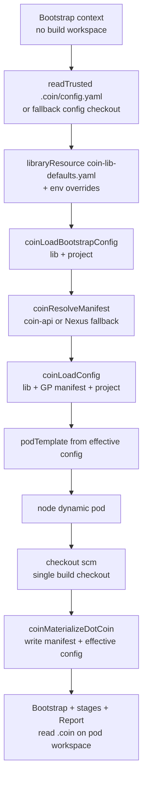
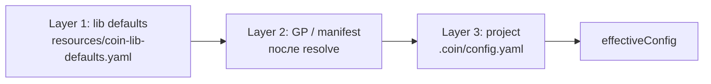

# Plan: coin-lib

## Контекст

Миграция на thin Jenkinsfile завершена (E2E green). Следующий шаг — навести порядок в самой Shared Library.

**Проблемы:**

1. **Мёртвый код** — [`coin-lib/src/coin/Pod.groovy`](coin-lib/src/coin/Pod.groovy) и [`Stages.groovy`](coin-lib/src/coin/Stages.groovy) нигде не `load`'ятся; runtime в [`vars/coinPipeline.groovy`](coin-lib/vars/coinPipeline.groovy) + [`vars/coinRunStage.groovy`](coin-lib/vars/coinRunStage.groovy).

2. **Размазанная конфигурация** — в `coinPipeline.groovy` десятки inline-defaults (`COIN_API_URL`, `COIN_MANIFEST_CACHE_BASE`, credential IDs, registry prefix в pod YAML, jnlp fallback). Это должно собираться из **трёх слоёв**, а не дублироваться в Groovy.

3. **Python в shell** — в [`coinPipeline.groovy`](coin-lib/vars/coinPipeline.groovy) четыре вызова `python3 -c 'import json; ...'` (Nexus fallback pointer/manifest hash, bootstrap `executor.url`). JSON-парсинг — зона Groovy/lib, не shell. Python на built-in agent и в product build path не требуем.

4. **Лишний stash/unstash** — manifest гоняется через `stash` между `node('built-in')` и k8s pod, хотя итоговая модель — файлы в `.coin/` workspace. Два отдельных `node('built-in')` + тройной `unstash` — legacy от эволюции pipeline.

## Решение: `.coin/` как runtime cache (без stash)

### Почему stash был

- Resolve писал `.coin/manifest.json` на **built-in** workspace.
- `podTemplate` → `node(pod)` — **новый** workspace; `checkout scm` не приносит `manifest.json` (он в `.gitignore`).
- `stash` был костылём передачи файла между агентами.

### Новая модель (согласовано)

Manifest и merged config живут в **памяти Groovy** (`manifest`, `cfg` maps) и **материализуются на диск** в `.coin/` там, где выполняются stages.



**Шаги:**

1. **Bootstrap context** (до pod; нужен только чтобы выбрать `runtime.image`):
   - primary: `readTrusted('.coin/config.yaml')` → `readYaml text: ...` без полного checkout;
   - fallback (если `readTrusted` недоступен для конкретного SCM/job): минимальный bootstrap checkout только для `.coin/config.yaml`;
   - `libraryResource('coin-lib-defaults.yaml')` + env overrides;
   - `coinLoadBootstrapConfig(projectCfg)` → `bootstrapCfg` (`lib + project`, GP слоя ещё нет);
   - `coinResolveManifest(bootstrapCfg)` → `manifest` map;
   - `coinLoadConfig(manifest, projectCfg)` → `cfg` (`lib + GP + project`);
   - никаких файлов workspace как SoT на этом шаге.

2. **podTemplate** из `cfg` (jnlp, stack image, registry prefix)

3. **Внутри pod** — рабочий `checkout scm`, затем **`coinMaterializeDotCoin(manifest, cfg)`**:
   - `.coin/manifest.json` — resolved manifest (как сейчас для coin-executor)
   - `.coin/effective-config.yaml` — склеенный lib+GP+project (новый артефакт для отладки Jenkins glue)

4. Дальше все stages / `coinRunStage` / `coin-executor` работают с файлами в `.coin/` — **без stash/unstash**.

**Убрать:** `stash 'coin-manifest'`, все `unstash`, второй верхнеуровневый `node('built-in')`.

**Нюанс:** при смене агента built-in → pod файлы с диска built-in не переносятся сами. Поэтому materialize **внутри pod** из Groovy-переменных (CPS-serializable maps), а не повторный HTTP resolve.

**CPS-ограничение:** `manifest` и `cfg` должны быть plain data (`Map/List/String/Boolean/Number`). Нельзя хранить Jenkins objects, closures, matchers, streams. Перед передачей в pod можно нормализовать структуры через `writeJSON/readJSON` roundtrip в bootstrap context, если Jenkins начнёт ругаться на сериализацию.

**`.gitignore`:** добавить `.coin/effective-config.yaml` в starter/product repos (рядом с `manifest.json`).

### `vars/coinMaterializeDotCoin.groovy`

```groovy
def call(Map manifest, Map cfg) {
  sh 'mkdir -p .coin'
  writeJSON file: '.coin/manifest.json', json: manifest
  writeYaml file: '.coin/effective-config.yaml', data: cfg
}
```

`coinMaterializeDotCoin` не перезаписывает source file `.coin/config.yaml` из repo. Это важно: product config остаётся тем, что закоммитила команда; effective config — runtime artifact.

## Решение: layered config

Merge выполняется **в coin-lib (Groovy)**, без изменения OpenAPI (local pilot).
Заимствуем у Jenkins Templating Engine не сам framework, а паттерны:

- **Configuration hierarchy** — конфиг собирается из упорядоченных governance-слоёв, а не из scattered defaults в pipeline.
- **Aggregated/effective config** — результат merge становится явным runtime artifact (`.coin/effective-config.yaml`), который можно читать при отладке.
- **Deterministic resolution** — порядок слоёв фиксирован и одинаков для всех build.
- **Library defaults are defaults** — lib даёт только значения по умолчанию; более близкие к продукту слои их переопределяют.
- **No hidden mutation** — merge не должен менять исходные layer maps; каждый слой можно залогировать отдельно.

### Порядок merge (приоритет при конфликте)



**Правило:** `lib` < `GP/manifest` < `project` — проект перебивает GP, GP перебивает lib defaults. Совпадает с [`docs/config.md`](docs/config.md): identity и `jenkins.credentials` — зона команды; runtime agent/stages — зона GP.

### Принципы merge

1. **Поздний слой побеждает**: `lib defaults` → `GP/manifest` → `project`.
2. **Map merge рекурсивный**: вложенные объекты объединяются, а не заменяются целиком.
3. **Scalars replace**: строки, числа, boolean заменяются значением более позднего слоя.
4. **Lists replace by default**: массивы не склеиваются. Например `pipeline.stages` приходит из manifest как цельный список. Если понадобится merge списков — это отдельное явное правило по конкретному ключу.
5. **Null/empty не удаляют значение**: `null`, пустая строка и пустой map из более позднего слоя не затирают предыдущее значение, если для ключа не задано явное `disable/remove` правило.
6. **Known keys only для lib/runtime**: `coin-lib` читает только Jenkins glue поля (`coin.*`, `jenkins.*`, `runtime.*`, `executor.*`, `pipeline.*`). Неизвестные project поля остаются в `project`/product config и не становятся поведением Jenkins glue.
7. **No business policy in lib defaults**: в `coin-lib-defaults.yaml` запрещены build rules, versioning, deliverables behavior, stage logic. Это остаётся в `coin-api`, manifest, `coin-executor`, `gp-content`.
8. **Traceability**: `effective-config.yaml` должен позволять понять итоговые значения; при необходимости добавляем рядом `.coin/effective-config.sources.json` как follow-up, но не в scope первой реализации.

### Содержимое слоёв

| Слой | Источник | Примеры полей |
|------|----------|---------------|
| **lib** | [`coin-lib/resources/coin-lib-defaults.yaml`](coin-lib/resources/coin-lib-defaults.yaml) | `coin.apiUrl`, `coin.manifestCacheBase`, `jenkins.credentials.apiToken`, `jenkins.credentials.nexus`, `jenkins.registry.prefix`, `jenkins.jnlp.image` (fallback), pod resources |
| **GP** | resolved `manifest.json` | `runtime.image`, `jnlp.image`, `executor.url`, `pipeline.stages`, `credentials.docker` (GP default) |
| **project** | `.coin/config.yaml` | `coin.goldenPath`, `coin.version`, `project.*`, `jenkins.credentials.docker` (override) |

**Env overrides (сохраняем):** перед merge lib-слой дополняется из Jenkins env (`COIN_API_URL`, `COIN_MANIFEST_CACHE_BASE`, `COIN_JNLP_IMAGE`) — как сейчас в [`docs/how-to/add-new-service-repo.md`](docs/how-to/add-new-service-repo.md).

### Реализация

1. **`resources/coin-lib-defaults.yaml`** — единственный файл defaults lib-слоя (вместо строк в Groovy).

2. **`vars/coinLoadConfig.groovy`** — global step:
   - `libraryResource('coin-lib-defaults.yaml')` → lib layer
   - apply env overrides на lib layer
   - `coinManifestToConfig(manifest)` → GP layer (маппинг manifest → тот же shape)
   - `projectCfg` из `readTrusted` / bootstrap read → project layer
   - `coinDeepMerge(lib, gp, project)` → `Map effectiveConfig`
   - optional: записать ключевые поля в `env.*` для shell/coinRunStage

3. **Рефакторинг [`coinPipeline.groovy`](coin-lib/vars/coinPipeline.groovy):**
   - bootstrap: `projectCfg` → `bootstrapCfg` → resolve manifest → `cfg = coinLoadConfig(manifest, projectCfg)`
   - убрать inline `def coinApi = env.COIN_API_URL ?: 'http://...'`
   - `coinPodYaml(cfg)` — registry prefix и resources из cfg, не hardcode
   - credentials IDs из `cfg.jenkins.credentials.*`
   - resolve/fallback URLs из `cfg.coin.*`

4. **Рефакторинг [`coinRunStage.groovy`](coin-lib/vars/coinRunStage.groovy):**
   - `COIN_API_URL` из `env` (выставлен в Resolve) или принимать cfg — без дублирования default string

5. **Не делаем в этом plan:**
   - merge в coin-api resolve / новые поля OpenAPI (follow-up для corp)
   - дублирование `platform_settings` из PG в lib — local pilot остаётся на lib defaults + env

## Решение: без Python в coin-lib

**Принцип:** `sh` только для I/O (curl, docker login, coin-executor). Парсинг JSON/YAML — **Groovy** (`readJSON` / `readYaml` из `pipeline-utility-steps`, уже в [`docker/jenkins/plugins.txt`](../../docker/jenkins/plugins.txt)).

### Текущие python3 (убрать)

| Место | Сейчас | Замена |
|-------|--------|--------|
| Nexus fallback L109–112 | `python3` читает `pointer.json` / `manifest.json` | `readJSON` в Groovy после `curl` |
| Bootstrap L151 | `python3` читает `executor.url` | `cfg.executor.url` из merged config / `readJSON` manifest |

### `vars/coinResolveManifest.groovy`

Вынести resolve + Nexus fallback из монолитного `sh """..."""`:

```groovy
// псевдокод
def call(Map cfg) {
  def ok = coinTryResolveApi(cfg)   // curl → .coin/manifest.json, return status
  if (!ok) {
    sh "curl -fsS '${pointerUrl(cfg)}' -o .coin/pointer.json"
    def pointer = readJSON file: '.coin/pointer.json'
    sh "curl -fsS '${pointer.blobUrl}' -o .coin/manifest.json"
    def manifest = readJSON file: '.coin/manifest.json'
    if (pointer.manifestHash != manifest.manifestHash) {
      error 'Coin: manifest hash mismatch (Nexus fallback)'
    }
  }
  return readJSON file: '.coin/manifest.json'
}
```

`coinPipeline` в bootstrap: `def manifest = coinResolveManifest(bootstrapCfg)` → `def cfg = coinLoadConfig(manifest, projectCfg)` → `podTemplate(coinPodYaml(cfg))` → materialize `.coin/*` внутри pod. `stash/unstash` не используется.

Bootstrap: `sh "curl ... '${cfg.executor.url}' ..."` — URL из Groovy-строки, без subprocess JSON.

**Критерий:** `rg python3 coin-lib/` → 0 совпадений.

### Shape effectiveConfig (черновик)

```yaml
coin:
  goldenPath: go-app      # project
  version: "*"            # project
  apiUrl: http://coin-api:8090
  manifestCacheBase: http://nexus:8081/repository/maven-snapshots
project:
  name: demo-go-app       # project
  artifactId: ...
  groupId: ...
  repository: ...
jenkins:
  credentials:
    docker: nexus-docker  # project wins over manifest
    apiToken: coin-api-token
    nexus: nexus-admin
  registry:
    prefix: localhost:8082/coin-docker
  jnlp:
    image: ...            # manifest.jnlp.image || lib default
runtime:
  image: ...              # manifest.runtime.image
executor:
  url: ...                # manifest.executor.url
pipeline:
  stages: [...]           # manifest.pipeline.stages
```

## Plan hygiene

**Удалить** (completed, superseded):

- [`.cursor/plans/jenkins-lib-nexus.plan.md`](jenkins-lib-nexus.plan.md)
- [`.cursor/plans/thin-jenkinsfile-coin-lib.plan.md`](thin-jenkinsfile-coin-lib.plan.md)

**Активный plan:** этот файл.

**Обновить ссылки:** [`.cursor/plans/README.md`](README.md), [`.cursor/plans/adr/README.md`](adr/README.md).

## Прочая гигиена coin-lib

### Удалить `src/coin/`

Pod.groovy и Stages.groovy — мёртвые дубликаты. После layered config **не** возвращаем `src/` для glue; merge-логика — в `vars/coinLoadConfig.groovy`.

### Починить [`coin-lib/Jenkinsfile`](../../coin-lib/Jenkinsfile)

`platform-starter` → `coin-lib` (миграция [`019_rename_lib_coin_lib.sql`](../../coin-api/migrations/019_rename_lib_coin_lib.sql)).

### Документация

- [`coin-lib/README.md`](../../coin-lib/README.md) — structure + layered config
- [`docs/config.md`](../../docs/config.md) — короткий раздел «Jenkins glue config layers» (lib / GP / project)

## Проверка

1. `cd docker && make coin-lib`
2. `demo-go-app/main` — SUCCESS; project `jenkins.credentials.docker` реально используется (не только manifest)
3. `make e2e-jenkins-lib` green
4. Stage View без регрессий

## Критические противоречия перед исполнением

### C1 — Bootstrap config read: один checkout vs совместимость SCM

Проблема: чтобы выбрать dynamic pod, нужен `.coin/config.yaml`; полный checkout хочется делать только внутри pod.

Варианты:

- **A. `readTrusted` primary + fallback bootstrap checkout** — рекомендуемый баланс. В multibranch читает файл из SCM без workspace; если Gitea/Job type не поддержит, fallback даёт рабочий путь ценой второго checkout.
- **B. Только `readTrusted`** — чище, один checkout всегда, но если step не сработает на нашем Gitea multibranch, build path заблокирован.
- **C. Два checkout** — максимально совместимо, но оставляет лишний bootstrap checkout.

**Решение:** **A. `readTrusted` primary + fallback bootstrap checkout**. В плане исполнения сначала реализовать `readTrusted`, а fallback включить как явную ветку с понятным log message.

### C2 — Scope `.coin/effective-config.yaml`: только Jenkins glue или input для executor

Проблема: `effective-config.yaml` содержит lib/GP/project merge. Если `coin-executor` продолжит читать `.coin/config.yaml`, то effective config влияет только на Jenkins glue. Если передать effective config в executor, придётся менять `coinRunStage`, `Report`, GP validate script и docs/schema.

Варианты:

- **A. Effective config только для `coin-lib`** — минимальный blast radius. `coin-executor` и GP scripts продолжают читать `.coin/config.yaml`. Project config по-прежнему обязан содержать поля, которые требует executor (`jenkins.credentials.docker` и т.п.).
- **B. Effective config как executor input** — `coinRunStage` вызывает `coin-executor run --project .coin/effective-config.yaml`; `report` тоже. Нужно обновить GP validate script на `COIN_CONFIG_PATH`, проверить schema/unknown fields. Больше пользы от layered config, но scope шире.

**Решение для первой реализации:** **A. Effective config только для `coin-lib`**. Сначала стабилизировать `coin-lib` как Jenkins glue. B вынести в follow-up, если хотим сделать layered config общим runtime contract.

### C3 — `manifest.credentials.docker` vs project `jenkins.credentials.docker`

Проблема: manifest сейчас содержит `credentials.docker`, но `coin-executor` config validation требует `jenkins.credentials.docker` в project config.

Варианты:

- **A. Считать manifest credential default только Jenkins glue default** — project может override, но executor contract пока не меняется.
- **B. Сделать credential полностью частью effective config** — требует C2/B.

**Решение:** **A** в этом plan.

### C4 — Merge semantics для empty values

Проблема: правило “empty не затирает” удобно для defaults, но не даёт пользователю намеренно очистить значение.

Варианты:

- **A. Нет удаления в первой версии** — null/empty игнорируются, explicit remove не поддерживается.
- **B. Ввести `__remove` / `enabled: false` по конкретным ключам** — больше гибкости, но нужен контракт.

Рекомендация: **A**. Для Jenkins glue defaults удаление сейчас не нужно.

## Критерии успеха

- [x] Один активный plan: `coin-lib.plan.md`; старые plans удалены
- [x] Нет hardcoded URL/credential defaults в `coinPipeline.groovy` (только через merged config)
- [x] `resources/coin-lib-defaults.yaml` + `vars/coinLoadConfig.groovy` работают
- [x] **Нет `python3` в `coin-lib/`** — resolve/fallback/bootstrap на `readJSON` + `coinResolveManifest`
- [x] **Нет stash/unstash** — `.coin/manifest.json` + `.coin/effective-config.yaml` materialize в pod
- [x] Bootstrap config read работает: `readTrusted` primary, documented fallback на bootstrap checkout
- [x] `.coin/effective-config.yaml` используется только `coin-lib`; `coin-executor` продолжает читать project `.coin/config.yaml`
- [x] `src/coin/` удалён; `coin-lib/Jenkinsfile` → `coin-lib`
- [x] E2E build path green (`demo-go-app/main` #21)

## Вне scope

- Phase 2 Nexus HTTP retriever для lib
- Semver publish lib > 1.0.0
- Server-side merge в coin-api resolve
