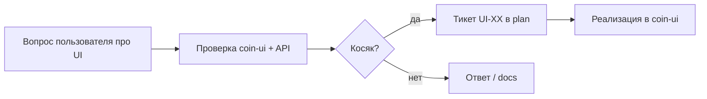

# coin-ui operator console

## Что делаем с предыдущим plan

- **Удалить** [`platform-first-delivery.plan.md`](.cursor/plans/platform-first-delivery.plan.md) (по решению: не archive).
- **Оставить** [`platform-native-jenkins.plan.md`](.cursor/plans/platform-native-jenkins.plan.md) как historical superseded (1 строка ссылки).
- **Обновить** [`plans/README.md`](.cursor/plans/README.md) — активный plan = **этот файл**.
- **Поправить** устаревшую ссылку в [`coin-project-gates.mdc`](.cursor/rules/coin-project-gates.mdc) (сейчас «активный plan platform-native-jenkins» → ссылка на новый plan).

---

## Модель работы (discovery-driven)



**Правила** (из [`plan-execution.mdc`](.cursor/rules/plan-execution.mdc)):

- Тикет **done** только когда plan обновлён + код/docs.
- Логика остаётся в **coin-api**; coin-ui — только вызов Admin API (граница [`coin-lib-scope.mdc`](.cursor/rules/coin-lib-scope.mdc) не затрагивается).
- Corp gate: Wave 1500, OIDC prod, prod repo split — **вне scope** (только local pilot).

**Стенд для проверок:** http://localhost:8091 (`make coin-ui-up`), ключ `dev-local-admin-key`.

---

## Текущее состояние coin-ui

| Route | Страница | Статус |
|-------|----------|--------|
| `/` | Dashboard | базовые stats |
| `/projects` | Projects + canary mode | есть |
| `/releases` | GP list + drafts toggle | есть |
| `/releases/:name/:version` | Detail, artifacts editor (draft), blast radius | есть |
| `/releases/publish` | Draft / publish / promote wizard | есть |
| `/catalog` | Pointers + policy edit | есть |
| `/resolve` | Resolve preview | есть |
| `/canary` | Policy + health | есть |
| `/components` | Registry | **read-only** |
| `/audit` | Audit log | есть |

Nav: [`coin-ui/src/components/Layout.tsx`](coin-ui/src/components/Layout.tsx)  
API client: [`coin-ui/src/lib/api.ts`](coin-ui/src/lib/api.ts)

---

## Кандидаты на проверку (не тикеты — до ваших вопросов)

Сверить при walkthrough; заводить **UI-XX** только после подтверждения:

| # | Гипотеза | API | UI сейчас |
|---|----------|-----|-----------|
| C1 | Component publish только curl | `POST /v1/admin/components/{type}/{name}/versions` | нет wizard |
| C2 | Multi-GP onboarding | `POST /v1/admin/golden-paths/profiles` | нет формы |
| C3 | Fleet scan из UI | `POST /v1/admin/scan` (admin) | нет кнопки |
| C4 | Stale projects на Dashboard | SQL в [fleet-analytics-pm.md](docs/how-to/fleet-analytics-pm.md) | нет метрики (нужен endpoint?) |
| C5 | README coin-ui устарел | — | нет catalog/canary/resolve в таблице routes |
| C6 | Manifest viewer | resolve-preview JSON | нет structured tree / diff |
| C7 | Health на release detail | `GET .../health` | только на Canary page |

---

## Формат тикета

```
UI-XX: <краткое описание>
Scope: coin-ui (+ coin-api только если нет endpoint)
AC:
  - ...
Verify: URL / роль / curl
```

Frontmatter todos: `pending` → `in_progress` → `completed`.

---

## Начальный backlog (bootstrap)

| ID | Задача | AC |
|----|--------|-----|
| **UI-00** | Plan hygiene | PF plan удалён; README + gates обновлены; новый plan active |
| **UI-01** | *(резерв)* | Заполняется первым подтверждённым косяком из Q&A |

После UI-00 backlog пополняется **только** по итогам ваших вопросов.

---

## Non-goals

- Wave rollout / corp Gitea / OIDC prod
- Prod repo split ([prod-repo-split.md](docs/runbooks/prod-repo-split.md))
- Новые manifest/OpenAPI контракты без эскалации
- coin-lib / fat Jenkinsfile

---

## Связанные docs (обновлять по мере тикетов)

- [`docs/coin-ui-user-guide.md`](docs/coin-ui-user-guide.md)
- [`coin-ui/README.md`](coin-ui/README.md)
- [`docs/how-to/fleet-analytics-pm.md`](docs/how-to/fleet-analytics-pm.md)
