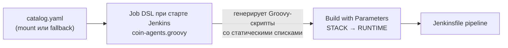

# coin-jenkins-agents

Docker-образы **CI agent** для Jenkins dynamic agents (K8s pod, контейнер `stack`).

Agent image — среда сборки сервиса: toolchain (test + native compile), `coin-golden-paths`, docker CLI.  
App images собираются в **service pipeline** (native compile → runtime-only GP Dockerfile).

Модель сборки — [docs/agent-build-model.md](../docs/agent-build-model.md).

---

## Структура каталога

```
coin-jenkins-agents/
  catalog.yaml          # manifest: registry, stacks, rev/tag/digest
  Jenkinsfile           # pipeline: docker build → push → bump catalog → git push
  stacks/
    <stack>/<runtime>/
      Dockerfile        # build context = корень monorepo coin
```

Job `coin-agents` состоит из **двух частей**:

| Часть | Файл | Ответственность |
|-------|------|-----------------|
| Pipeline | `coin-jenkins-agents/Jenkinsfile` | сборка, push, обновление `catalog.yaml` |
| Job + параметры UI | `docker/jenkins/jobs/coin-agents.groovy` | объявление job, Active Choices |
| Регистрация job | `docker/jenkins/casc-jobs.yaml` | JCasC: `file: …/coin-agents.groovy` |

Параметры **не** объявляются в `Jenkinsfile` — только в Job DSL (требование плагина Active Choices).

---

## catalog.yaml

Единственный manifest agent images. Jenkins job **пишет** в него `rev`, `tag`, `digest` после каждой успешной сборки.

```yaml
registry:
  default: registry:5000/coin      # prefix registry (host/path)
  credentialsId: nexus-docker      # Jenkins credential для docker login/push

stacks:
  python-uv:
    "3.13":
      image: ci-python-uv          # имя репозитория (без registry prefix)
      rev: 0                         # счётчик пересборки (job инкрементирует)
      tag: ""                        # заполняет job: {runtime}-r{rev}
      digest: ""                     # sha256 образа после push
      dockerfile: coin-jenkins-agents/stacks/python-uv/3.13/Dockerfile
      pins:                          # опционально: ARG для Dockerfile
        uv: "0.6.14"
```

### Версионирование tag

| Поле | Кто задаёт | Пример | Смысл |
|------|------------|--------|-------|
| runtime | GP / ключ в catalog | `3.13`, `1.22`, `17` | версия toolchain |
| rev | Jenkins job (+1 за сборку) | `3` | номер пересборки agent |
| tag | job | `3.13-r3` | `{runtime}-r{rev}` |
| digest | job | `sha256:…` | pin артефакта в registry |

Полный ref образа: `{registry.default}/{image}:{tag}` → `registry:5000/coin/ci-python-uv:3.13-r3`.

История rev в catalog **не хранится** — только текущее значение; откат через git.

---

## Связь с golden path и images.yaml

Связь GP → agent **односторонняя** (обратный индекс `goldenPaths` не нужен):

```
profile.yaml          catalog.yaml              images.yaml
agent.stack: go   →   stacks.go."1.22"    →   stacks.go."1.22".image
agent.runtime.go      rev, tag, digest         (после promote)
```

| Слой | Файл | Роль |
|------|------|------|
| GP defaults | `coin-golden-paths/<template>/vN/profile.yaml` | `agent.stack`, `agent.runtime` |
| Agent manifest | `catalog.yaml` | сборка, rev/tag/digest |
| Runtime lookup | `coin-lib/resources/images.yaml` | выбор образа в service pipeline |
| Platform CI | Jenkins `coin-agents` | сборка agent → registry |

**Promote** `catalog.yaml` → `images.yaml` — **отдельный шаг** (не автоматически при каждой сборке agent):

```bash
docker/scripts/sync-agent-images.sh
```

---

## Содержимое agent image

| Компонент | В образе? |
|-----------|-----------|
| Toolchain (go, uv, jdk, …) | да |
| `coin-golden-paths/` (`COIN_GOLDEN_PATHS_DIR`) | да |
| docker CLI | да |
| `coin` CLI | **нет** — доставка в service pipeline (coin-lib → Nexus) |

Build context — **корень monorepo** `coin` (Dockerfile делает `COPY coin-golden-paths …`).

---

## Jenkins job `coin-agents`

### Что делает pipeline

1. Читает `catalog.yaml` из workspace (checkout monorepo).
2. Определяет targets: один `(STACK, RUNTIME)` или все пары при `BUILD_ALL=true`.
3. Для каждой пары:
   - `docker build -f <dockerfile> -t <registry>/<image>:<runtime-rN> .`
   - `docker push`
   - bump `rev`, `tag`, `digest` в `catalog.yaml`
   - `git commit` + `git push` с `[skip ci]`

### Credentials (Jenkins)

| ID | Назначение |
|----|------------|
| `nexus-docker` | docker login / push (`catalog.registry.credentialsId`) |
| `gitea-git` | git push `catalog.yaml` в monorepo |

### Параметры сборки

| Параметр | Тип | Описание |
|----------|-----|----------|
| `STACK` | Active Choices (single select) | toolchain stack из `catalog.yaml` |
| `RUNTIME` | Active Choices Reactive | runtime для выбранного `STACK` |
| `BUILD_ALL` | boolean | собрать все `stacks.*` (игнорирует STACK/RUNTIME) |

---

## Active Choices

Плагин: **Active Choices** (`uno-choice`).  
Job DSL: dynamic API (`choiceParameter` + `cascadeChoiceParameter`) с `sandbox(true)` — иначе reactive-параметр `RUNTIME` не обновляется при смене `STACK`.

### Как устроено



1. **При старте Jenkins** (применение JCasC / Job DSL) `coin-agents.groovy` читает `catalog.yaml` и парсит секцию `stacks`.
2. Из catalog генерируются два Groovy-скрипта:
   - `STACK` → `return ["go", "python-uv", …]`
   - `RUNTIME` → `if (STACK == 'go') return ["1.22"] else if …`
3. Скрипты **запекаются** в конфиг job (sandbox-friendly, без HTTP/File в runtime UI).
4. В UI при смене `STACK` cascade-параметр `RUNTIME` пересчитывается на лету.

### Откуда Job DSL читает catalog

| Окружение | Путь | Как обновляется |
|-----------|------|-----------------|
| Local docker-compose | `/var/jenkins_home/coin-agents-catalog.yaml` | bind-mount `coin-jenkins-agents/catalog.yaml` |
| Jenkins без mount | — | fallback-списки в `coin-agents.groovy` (`defaultStacks()`) |

Local mount в `docker/compose.yml`:

```yaml
volumes:
  - ../coin-jenkins-agents/catalog.yaml:/var/jenkins_home/coin-agents-catalog.yaml:ro
```

### Важно после изменения catalog

Добавили stack/runtime в `catalog.yaml` → **перезапустите Jenkins**, чтобы Job DSL перечитал catalog и обновил списки в UI:

```bash
cd docker && docker compose restart jenkins
```

Пересборка образа Jenkins нужна только при изменении `coin-agents.groovy`, `plugins.txt` или `casc-jobs.yaml`.

### Ограничения

- Списки в UI отражают catalog **на момент последнего старта Jenkins**, не live из git.
- `BUILD_ALL` обходит UI-параметры и читает актуальный `catalog.yaml` из workspace при запуске pipeline.
- Параметры объявлены в Job DSL, **не** в `Jenkinsfile` — дублировать `parameters {}` в pipeline нельзя.

---

## Развертывание job

### A. Локальный стенд (docker-compose)

Преднастроено в monorepo — job создаётся автоматически через JCasC.

#### 1. Плагины и Job DSL

В образ Jenkins (`docker/jenkins/Dockerfile`):

- `plugins.txt` — `uno-choice`, `job-dsl`, `pipeline-utility-steps`, …
- `jobs/coin-agents.groovy` — job + Active Choices
- `casc-jobs.yaml` — строка `- file: /usr/share/jenkins/ref/jobs/coin-agents.groovy`

#### 2. Поднять стенд

```bash
cd docker
make bootstrap
```

Bootstrap поднимает Gitea, registry, Jenkins, пушит monorepo и запускает platform build (`coin-cli` → `coin-agents?BUILD_ALL=true`).

#### 3. Первый запуск / обновление Jenkins

После изменений в `docker/jenkins/` (плагины, Job DSL, CASC):

```bash
cd docker
docker compose build jenkins
docker compose up -d jenkins
```

Дождитесь старта → **http://localhost:8080** → job **coin-agents** должен появиться в списке.

#### 4. Проверка Active Choices

1. Откройте **coin-agents** → **Build with Parameters**.
2. Убедитесь, что `STACK` содержит stacks из catalog.
3. Смените `STACK` — список `RUNTIME` должен обновиться (например `go` → `1.22`, `python-uv` → `3.13`).
4. Если `RUNTIME` не реагирует на `STACK` — проверьте, что установлен `uno-choice` и в job включён Groovy Sandbox для cascade-параметра (задаётся в Job DSL).

#### 5. Ручной запуск

| Сценарий | Параметры |
|----------|-----------|
| Один agent | `STACK=python-uv`, `RUNTIME=3.13`, `BUILD_ALL=false` |
| Все agents | `BUILD_ALL=true` (STACK/RUNTIME игнорируются) |
| Через CLI | `make platform-build` или `docker/scripts/trigger-platform-build.sh` |

#### 6. Promote для service pipeline

```bash
docker/scripts/sync-agent-images.sh
```

Обновляет `coin-lib/resources/images.yaml` (и `docker/images-local.yaml` на local стенде).

---

### B. Standalone Jenkins (prod / свой инстанс)

#### 1. Плагины

Установите:

- Pipeline (workflow-aggregator)
- Git, Credentials Binding
- **Active Choices** (`uno-choice`)
- **Job DSL** (если job создаётся через DSL)
- Pipeline Utility Steps (`readYaml` в pipeline)

#### 2. Credentials

| ID | Тип | Назначение |
|----|------------|
| `nexus-docker` | Username/Password | docker push в registry |
| `gitea-git` | Username/Password | SCM monorepo + git push catalog |

#### 3. Создание job

**Вариант 1 — Job DSL (рекомендуется, как в monorepo):**

1. Скопируйте `docker/jenkins/jobs/coin-agents.groovy` на controller (или подключите через JCasC `jobs: - file: …`).
2. Обеспечьте доступ Job DSL к catalog при старте:
   - mount `catalog.yaml` → `/var/jenkins_home/coin-agents-catalog.yaml`, **или**
   - обновите `defaultStacks()` в `coin-agents.groovy` под ваш catalog.
3. Примените Job DSL (JCasC reload / seed job / restart).

**Вариант 2 — вручную в UI:**

1. **New Item** → **Pipeline** → имя `coin-agents`.
2. **Pipeline** → Definition: **Pipeline script from SCM**.
   - SCM: Git, URL monorepo `coin`, credentials, branch `main`.
   - Script Path: `coin-jenkins-agents/Jenkinsfile`.
3. **This project is parameterized** — добавьте вручную:
   - Active Choices Parameter `STACK` (Groovy script со списком stacks).
   - Active Choices Reactive Parameter `RUNTIME` (referenced: `STACK`, Groovy if/else по stack).
   - Boolean `BUILD_ALL`.
4. Включите **Use Groovy Sandbox** для обоих Active Choices.

Проще поддерживать вариант 1 — скрипт генерируется из catalog автоматически.

#### 4. Требования к Jenkins agent

Job `coin-agents` использует `agent any` и выполняет `docker build/push` на **Jenkins controller** (local стенд: controller в группе `docker`, mount `docker.sock`).

На prod убедитесь, что node с label для platform jobs имеет:

- docker CLI + доступ к registry
- checkout monorepo (build context = корень repo)

#### 5. Registry и git push

- `catalog.registry.default` — URL prefix registry (например `registry.example.com/coin`).
- Pipeline пушит commit в branch `main` monorepo — настройте права `gitea-git` / branch protection с учётом `[skip ci]`.

---

## Добавить stack / runtime

Пример: Python 3.14 для `python-uv`.

1. **Dockerfile** — `stacks/python-uv/3.14/Dockerfile`.
2. **catalog.yaml** — новая запись под `stacks.python-uv."3.14"` (`rev: 0`, пустые `tag`/`digest`).
3. **GP** — v2 с `runtime.python: "3.14"` или обновление profile.
4. **Jenkins** — `docker compose restart jenkins` (обновить Active Choices).
5. **Сборка** — `coin-agents` с `STACK=python-uv`, `RUNTIME=3.14`.
6. **Promote** — `sync-agent-images.sh` → commit `images.yaml` (если нужно для service pipeline).

---

## Troubleshooting

| Симптом | Причина | Решение |
|---------|---------|---------|
| Job `coin-agents` отсутствует | JCasC/Job DSL не применился | пересобрать образ Jenkins, проверить `casc-jobs.yaml` |
| `STACK` / `RUNTIME` не видны | параметры только в Job DSL | не добавлять `parameters {}` в Jenkinsfile |
| `RUNTIME` не меняется при смене `STACK` | Groovy Sandbox выключен для cascade | использовать `coin-agents.groovy` as-is (`sandbox(true)`) |
| В `STACK` старый список | Job DSL не перечитал catalog | `docker compose restart jenkins` после правки catalog |
| `catalog: нет stacks.X.Y` | несоответствие UI и catalog | проверить catalog.yaml; перезапустить Jenkins для UI |
| docker push failed | credentials / registry | проверить `nexus-docker`, `catalog.registry` |
| git push failed | credentials / права | проверить `gitea-git`, права на `main` |

---

## Связанные документы

- [docs/agent-build-model.md](../docs/agent-build-model.md) — модель agent + runtime-only GP
- [docs/jenkins-setup.md](../docs/jenkins-setup.md) — Jenkins, credentials, coin-lib
- [docker/README.md](../docker/README.md) — локальный стенд, bootstrap, platform build
