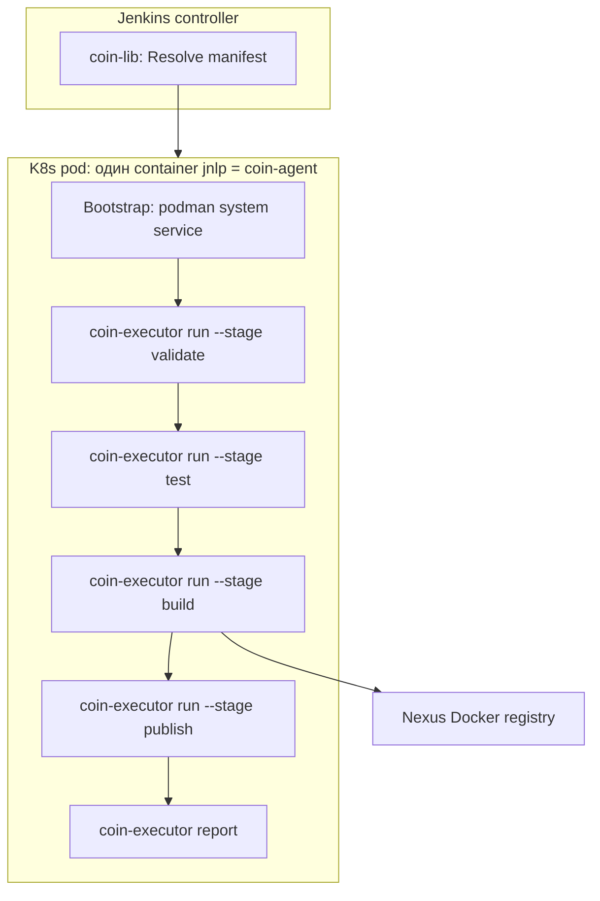

# Build engines и runtime agent

Модель сборки Coin после hard cut **build-engine contract** (ADR [build-engine-contract](adr/build-engine-contract.md)).

Продукт **не** выбирает engine — он зафиксирован в GP content (`coin-gp-content/stacks/<gp>/content.yaml`) и приходит в manifest как `build.engine`.

---

## Компоненты

| Слой | Роль |
|------|------|
| **GP content** | SoT: `build.engine`, Containerfile (buildkit/dockerfile), Paketo builder (buildpack), schema, typed `pipeline.stages` |
| **coin-api** | Resolve → manifest с `build`, `runtime.image`, `executor`, typed stages |
| **coin-agent** | Единый Jenkins inbound-agent image: `coin-executor`, `podman`, `pack`, buildkit binaries (fallback) |
| **coin-executor** | `validate` / `run --stage` / `publish` — dispatch по `manifest.build.engine` |
| **coin-lib** | Jenkins glue: resolve, pod, credentials, bootstrap podman, вызов executor |

**Не используется:** language-specific stack agents (`coin-jenkins-agents/`), GP `scripts/*.sh` в runtime, dual-container pod (`jnlp` + `stack`), bootstrap `curl coin-executor`.

---

## Три build engine (local pilot)

| Engine | Golden path (sample) | Сборка образа | Managed Containerfile |
|--------|----------------------|---------------|------------------------|
| `buildkit` | `go-app` | BuildKit targets через **podman build** (см. ниже) | Да — multi-stage с targets `validate`, `test`, `runtime`, `artifact` |
| `buildpack` | `go-app-bp` | `pack build` + podman | Нет |
| `dockerfile` | `go-app-df` | **podman build** по targets `test` / `image` | Да — явные `imageTarget` / `testTarget` |

Эталон content:

- [`coin-gp-content/stacks/go-app/content.yaml`](../coin-gp-content/stacks/go-app/content.yaml)
- [`coin-gp-content/stacks/go-app-bp/content.yaml`](../coin-gp-content/stacks/go-app-bp/content.yaml)
- [`coin-gp-content/stacks/go-app-df/content.yaml`](../coin-gp-content/stacks/go-app-df/content.yaml)

E2E на стенде:

```bash
cd docker
make seed-jenkins-lib          # lib + gp-content + GP profiles
make publish-agent             # coin-agent → Nexus (arm64: GOARCH=arm64)
make samples                   # demo-go-app, demo-go-app-bp, demo-go-app-df
make e2e-build-engines         # все три job → SUCCESS
```

---

## Поток CI



### Стадии (typed, без script URL)

| Stage | Поведение |
|-------|-----------|
| `validate` | JSON schema `.coin/config.yaml` + manifest capabilities |
| `test` | buildkit/dockerfile: target `test` в Containerfile; buildpack: `pack` с `BP_RUN_TESTS=true` |
| `build` | Сборка image → `.coin/outputs.json` |
| `publish` | Push image (параметр Jenkins `publish=true` или `when: tag`) |

Orchestration — только `coin-lib` (`coinPipeline()`), не Groovy из Nexus.

---

## Manifest: секция `build`

Схема: [`coin-api/manifest.schema.json`](../coin-api/manifest.schema.json).

Пример (`go-app`, buildkit):

```json
{
  "build": {
    "engine": "buildkit",
    "buildkit": {
      "dockerfile": ".coin/Containerfile",
      "targets": {
        "validate": "validate",
        "test": "test",
        "image": "runtime",
        "artifact": "artifact"
      },
      "cacheRef": "nexus:8082/coin-cache/demo-go-app:buildkit",
      "containerfile": {
        "url": "http://nexus:8081/repository/maven-releases/coin/gp/content/go-app/1.0.2/...",
        "sha256": "sha256:..."
      }
    }
  },
  "pipeline": {
    "stages": [
      { "id": "validate", "name": "Validate" },
      { "id": "test", "name": "Test" },
      { "id": "build", "name": "Build" },
      { "id": "publish", "name": "Publish", "when": "tag" }
    ]
  }
}
```

`buildpack` и `dockerfile` — поля `build.buildpack` / `build.dockerfile` (см. schema).

Managed Containerfile materialize в workspace: `.coin/Containerfile` (путь из `build.*.dockerfile`).

---

## coin-agent image

Собирается из [`coin-executor/Dockerfile.agent`](../coin-executor/Dockerfile.agent), публикуется скриптом `coin-executor/scripts/publish-agent.sh`.

| Компонент | Назначение |
|-----------|------------|
| `jenkins/inbound-agent` | JNLP remoting |
| `coin-executor` | Baked binary (не curl в bootstrap) |
| `podman` | Container builds + socket для `pack` |
| `pack` | Buildpack engine |
| `buildkitd` / `buildctl` | В образе для fallback; **не** стартуют в bootstrap на local pilot |
| `paketo-builder.tar` | Baked builder для buildpack (load в bootstrap) |

Registry (runtime): `nexus:8082/coin-docker/coin-agent:{semver}`.

Composition slot: `agent` → `coin-agent@version` (не stack-specific images).

---

## Pod template (coin-lib)

[`coin-lib/resources/coin-pod-template.yaml`](../coin-lib/resources/coin-pod-template.yaml):

- один container `jnlp` = `manifest.runtime.image`
- `securityContext.privileged: true`, `procMount: Unmasked` (nested containers)
- `emptyDir` 12Gi → `/var/lib/containers/storage` (podman graph)
- env `COIN_BUILD_ENGINE` из manifest (`buildkit` | `buildpack` | `dockerfile`)

---

## Bootstrap (coinPipeline)

1. `podman system service` → `unix:///var/run/docker.sock`
2. **buildpack only:** `podman load` из `/usr/share/coin/paketo-builder.tar` (если builder ещё не в store)
3. `coin-executor version`

`buildkitd` **не** запускается на local pilot arm64 — см. ниже.

---

## Реализация engine в coin-executor

| Engine | Implementation |
|--------|----------------|
| `buildkit` | `RunTarget()` → **podman build** если socket есть, иначе `buildctl` |
| `dockerfile` | то же (другие targets из manifest) |
| `buildpack` | `pack build` с `--docker-host inherit`, `--network host`, pinned `BP_GO_VERSION` |

Buildpack на arm64 pilot: builder jammy-base amd64, работает через baked tar + host network.

### Local pilot arm64: почему podman, а не buildctl

В k3s на Apple Silicon `buildctl` + `RUN` в Dockerfile даёт `exec /bin/sh: invalid argument` (nested runc). **Обходной путь pilot:** container builds через podman в том же privileged pod. Контракт `build.engine: buildkit` сохранён; implementation — podman на этом стенде.

На amd64 corp (roadmap) — нативный buildkitd + buildctl без podman-fallback.

---

## Registry cache

`cacheRefTemplate` в GP content подставляет `{{registryHost}}` и `{{project}}`.

Пример: `nexus:8082/coin-cache/demo-go-app:buildkit`.

---

## Операционные заметки (local pilot)

| Симптом | Причина | Действие |
|---------|---------|----------|
| Pod `TerminationByKubelet` ephemeral-storage | Диск k3s полон (agent image ~3GiB + podman load) | `make e2e-build-engines` (с prune) или `bash docker/scripts/prune-k3s-disk.sh --all` |
| `short-name golang:… did not resolve` | podman registries.conf | В agent image: `unqualified-search-registries = ["docker.io"]` |
| manifest sha256 mismatch | Nexus immutable + обновлён gp-content metadata | Новый gp-content semver + **новый GP release** (не UPDATE blob) |
| Старый bootstrap (buildkitd) в логе | Jenkins cache Shared Library | `make coin-lib` (очищает `caches/git-*`) |
| `component_version` seed берёт 1.0.0 | API order ≠ semver max | Исправлено в `seed-jenkins-lib-stack.sh` |

---

## Superseded (не документировать / не реализовывать)

- `coin-jenkins-agents/`, `agents-build`, stack catalog `images.yaml`
- Native compile в language agent + `pack-image.sh`
- `coin-golden-paths/` monolith tree с `scripts/test.sh`
- Host `docker.sock` mount
- `manifest.pipeline.stages[].script.url`
- `manifest.jnlp` / отдельный stack container

---

## См. также

- [golden-paths.md](golden-paths.md) — composition, samples
- [jenkins-setup.md](jenkins-setup.md) — credentials, platform jobs
- [config.md](config.md) — что в проекте vs manifest
- [how-to/troubleshoot-ci.md](how-to/troubleshoot-ci.md) — CI errors
- [docker/README.md](../docker/README.md) — make targets, стенд
