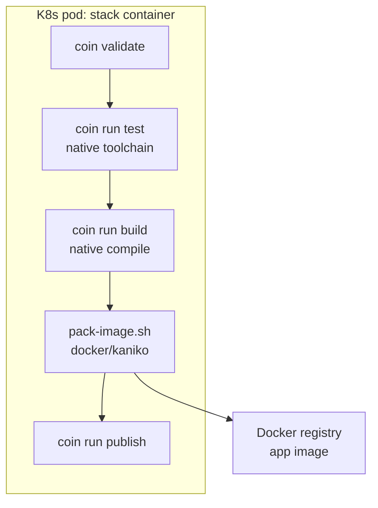
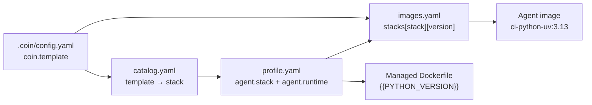

# Модель сборки: agent + runtime-only Dockerfile

Единая модель сборки для всех `*-app` golden paths. Обязательна для platform и сервисных pipeline.

---

## Решение

| Слой | Роль |
|------|------|
| **Agent stack image** | CI runtime: test + native compile |
| **Managed Dockerfile** | runtime-only: `COPY` артефактов в минимальный base |
| **docker / kaniko** | factory OCI image → registry (не компилятор) |

Multi-stage Dockerfile с builder stage (`AS builder`) **запрещён** в managed GP.

---

## Поток стадий



### `coin run test`

Нативно в agent: `go test`, `uv run pytest`, `gradle test`, …

### `coin run build` (`build.type: container`)

1. **Native compile** — toolchain agent image (тот же, что для test).
2. **Pack** — `_shared/pack-image.sh`: docker/kaniko + runtime-only Dockerfile из GP.

Артефакты по стекам:

| GP | Native output | Runtime Dockerfile |
|----|---------------|-------------------|
| `go-app` | `dist/app` | distroless + `COPY dist/app` |
| `python-uv-app` | `.venv/` + `src/` | python-slim + `COPY .venv`, `src` |
| `python-pip-app` | `.venv/` + `src/` | python-slim + `COPY .venv`, `src` |
| `java-gradle-app` | `build/libs/*.jar` | JRE + `COPY *.jar` |
| `java-maven-app` | `target/*.jar` | JRE + `COPY *.jar` |

### `coin run build` (`build.type: package`, `*-lib`)

Только native compile, docker не используется.

---

## Связь golden path ↔ agent image

Связь **не** «1 GP = 1 образ», а **stack + runtime version**:



| Шаг | Источник | Пример |
|-----|----------|--------|
| 1 | `coin.template` | `python-uv-app` |
| 2 | `catalog.yaml` | stack `python-uv` |
| 3 | `profile.agent.runtime` | `python: "3.13"` (дефолт GP) |
| 4 | `jenkins.runtime` (optional) | override в проекте |
| 5 | `images.yaml` | `coin/ci-python-uv:3.13` |
| 6 | coin-lib | K8s pod stack container |
| 7 | coin-cli render | `{{PYTHON_VERSION}}` = та же версия |

Несколько GP (`python-uv-app`, будущий `python-uv-lib`) → **один** agent `python-uv:3.13`.

---

## Структура `coin-golden-paths/`

```
coin-golden-paths/
  _shared/
    pack-image.sh              # docker/kaniko после native build
  catalog.yaml
  python-uv-app/
    v1/
      profile.yaml             # agent.stack, agent.runtime, build.type
      Dockerfile               # runtime-only
      scripts/
        test.sh                # native
        build.sh               # native + source pack-image.sh
        publish.sh
      config.yaml
```

---

## Agent images (`coin-jenkins-agents/`)

Agent = **CI build environment**, не app runtime.

| Компонент | Зачем |
|-----------|-------|
| Toolchain (go, uv, jdk+gradle, …) | test + native compile |
| `coin-golden-paths/` | scripts + Dockerfile (или fetch из Nexus) |
| `docker` CLI или kaniko | pack на build-стадии |
| git, ca-certificates | checkout, deps |

`coin` CLI в agent image **не** зашивается — доставляется в pipeline (coin-lib, Nexus Maven).

### Именование и каталог

```
coin-jenkins-agents/
  catalog.yaml              # manifest: rev, tag, digest
  Jenkinsfile               # единый platform CI
  stacks/<stack>/<runtime>/
    Dockerfile              # build context = monorepo root
```

Индекс: `coin-jenkins-agents/catalog.yaml`. Runtime lookup: `images.yaml` → `stacks.<stack>.<runtime>` (после promote через `sync-agent-images.sh`).

| Job | Параметры | GP |
|-----|-----------|-----|
| `coin-agents` | `STACK`, `RUNTIME`, `BUILD_ALL` | GP: `profile.agent.stack` + runtime |

Image tag: `{runtime}-r{N}` (например `3.13-r2`); в `images.yaml` — `coin/ci-<name>:<tag>`.

---

## Версионирование (три независимых слоя)

| Слой | Частота | Пример |
|------|---------|--------|
| Agent image | редко | Python 3.13 → 3.14 |
| coin-cli | часто | `dev`, `0.2.0` |
| GP catalog | очень часто | правки scripts/Dockerfile в v1 |

Смена runtime: новый agent + запись в `images.yaml` + GP v2 или обновление `profile.agent.runtime`.

---

## Pack: local dev vs prod

| Окружение | Pack |
|-----------|------|
| Local compose (k3s) | docker CLI + mount `docker.sock` (`PodTemplate.local.groovy`) |
| Prod K8s | kaniko (sidecar — roadmap) |

`pack-image.sh` поддерживает оба: сначала kaniko, fallback docker.

---

## См. также

- [golden-paths.md](golden-paths.md) — матрица GP
- [config.md](config.md) — `coin.template`, `jenkins.runtime`
- [architecture.md](architecture.md) — компоненты
- [jenkins-setup.md](jenkins-setup.md) — platform jobs
- [docker/README.md](../docker/README.md) — локальный стенд
