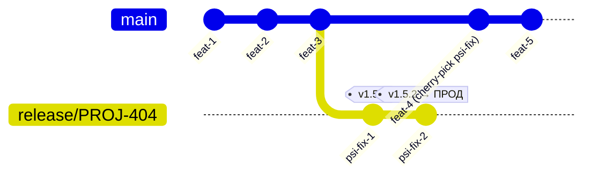

# Модель ветвления (Coin)

Версию артефактов ведёт **Coin** и вычисляет её из Git (см. [Единое версионирование](config.md#единое-версионирование)).
Поэтому модель ветвления — это **часть контракта**: имя ветки/наличие тега напрямую определяют `COIN_VERSION`,
тег образа и право на публикацию релиза. Разработчик не задаёт версию в сборщике — он выбирает правильную ветку/тег.

## Обязательные правила именования веток

Имя ветки — это контракт. Coin использует его для расчёта `COIN_VERSION` и маршрутизации в пайплайне.

### Формат

```
<тип>/<JIRA-ID>
```

Примеры:

| Тип | Пример | Назначение |
|-----|--------|------------|
| `feature/` | `feature/PROJ-101` | новая функциональность |
| `bugfix/` | `bugfix/PROJ-202` | исправление бага (до релиза) |
| `hotfix/` | `hotfix/PROJ-303` | срочный фикс прода |
| `release/` | `release/PROJ-404` | стабилизация + ПСИ (только релиз-менеджер) |

### Правила

- **Только тип + Jira ID.** Никаких версий, имён, описаний в названии ветки.
- **Нельзя:** `feature/PROJ-101-add-login`, `feature/v1.5-login`, `feature/my-cool-thing`, `release/PROJ-404`.
- **Можно** добавить короткий slug через дефис если это принято в команде: `feature/PROJ-101-login` — но Jira ID обязателен и стоит первым после типа.
- **Версию в имя ветки не пишем никогда** — версия живёт в теге, не в ветке.

### Почему это важно

Coin строит `COIN_VERSION` из имени ветки. Если имя содержит версию (например `feature/v1.5-login`), версия в snapshot-сборках будет некорректной: `0.0.0-feature-v1.5-login.3+abc`. Jira ID в имени — читаемая трассировка; Coin его не парсит, он просто остаётся в логах сборки.

---

## Принятая модель: trunk-based + релизные теги

Одна долгоживущая ветка `main` (trunk), короткоживущие ветки от неё, релиз закрывается **тегом**.
Для тяжёлого релизного процесса (ПСИ, approvals, change management) используется стабилизационная ветка `release/X.Y`.



## Ветки, версии и публикация

| Git-объект | Назначение | `COIN_VERSION` | Publish |
|------------|------------|----------------|---------|
| тег `vX.Y.Z` | релиз (единственный источник) | `X.Y.Z` | да |
| `release/PROJ-404` | стабилизация + ПСИ | `0.0.0-rc.proj-404.<build>+<sha>` | нет (только теги) |
| `main` | trunk, интеграция | `0.0.0-main.<build>+<sha>` | нет |
| `feature/*`, `bugfix/*` | разработка | `0.0.0-<branch>.<build>+<sha>` | нет |
| `hotfix/*` | срочный фикс прода | `0.0.0-<branch>.<build>+<sha>` | нет (релиз закрывается тегом) |

Правила:

- **Релизную версию даёт только тег `vX.Y.Z`.** Никакая ветка не выпускает релиз без тега.
- **`+<sha>` (build metadata)** есть только у не-релизных версий; в Docker tag `+` заменяется на `-`.
- Имя ветки приводится к безопасному виду (lowercase, не-`[0-9a-z.-]` → `-`).

---

## Жизненный цикл фичи

1. От `main` создаётся `feature/<jira>-<slug>`.
2. Коммиты в ветку → snapshot-сборки, без публикации.
3. PR в `main` → code review + QG в Coin → merge.

**Важно:** фича мержится в `main` только когда готова ехать в ближайший релиз.
Если фича не готова к релизу — ветка живёт, в `main` не идёт.

---

## Жизненный цикл релиза (с ПСИ)

### Шаг 1 — Фиче-фриз и создание release-ветки

Перед тем как резать релиз — **коротко договариваются с командой**: какие фичи едут, какие нет.
Нужные фичи (1, 2, 3) уже в `main`. Ненужные (4) — ещё в своих ветках, не влиты.

```
main:  ──●──●──●──  ← здесь режем release/PROJ-404 (фичи 1, 2, 3 внутри)
          1  2  3

фича 4:        ●──●──  (ещё в ветке, попадёт в следующий релиз)
```

От `main` режется `release/PROJ-404`. После этого `main` **сразу размораживается** — команда продолжает работу над следующим релизом.

### Шаг 2 — Сборка дистрибутива

На `release/PROJ-404` ставится тег `v1.5.0` → Coin собирает дистрибутив → уходит на ПСИ.

### Шаг 3 — ПСИ: итерации до приёмки

Нашли замечание → фикс идёт **только в `release/PROJ-404`** (не в `main` напрямую).

Каждая итерация ПСИ = отдельный коммит + **новый RC-тег** (`coin release bump --type rc`):

```
coin release bump --type rc  →  v1.5.0-rc.1  →  ПСИ
                                    замечание → фикс
coin release bump --type rc  →  v1.5.0-rc.2  →  ПСИ
                                    замечание → фикс
coin release bump --type rc  →  v1.5.0-rc.3  →  ПСИ → ПРИНЯТО
```

После приёмки ставится финальный тег:
```
coin release bump --type patch  →  v1.5.0  →  ПРОД
```

Каждый RC-тег = отдельная сборка Coin = трассируемый артефакт в registry. Нельзя «пересобрать» тот же тег.

**Сразу после каждого фикса** — cherry-pick в `main`. Иначе следующий релиз потеряет исправление.

### Шаг 4 — Деплой на прод

Принятый дистрибутив (`v1.5.2`) деплоится на прод. Ветка `release/PROJ-404` закрывается — новых коммитов больше не принимает.

### Итог потока

```
main:       ──●──●──●──────────────────────────(cp)──(cp)──●──●──
               1  2  3                          ↑     ↑    4  5
                      │             cherry-pick фиксов из ПСИ
                      │                         │     │
release/PROJ-404:          └── v1.5.0 ── fix ── v1.5.1 ── fix ── v1.5.2 → ПРОД ✓
                          (ПСИ)             (ПСИ)            (принято)
```

---

## Release notes

Release notes для `v1.5.2` должны отражать **весь контент дистрибутива**, а не только последний фикс.

**Правило:** release notes считаются от предыдущего продакшн-релиза до текущего тега:
```
git log v1.4.3..v1.5.2  →  все тикеты из smart commits  →  release notes
```

Так `v1.5.0`, `v1.5.1`, `v1.5.2` всегда несут в release notes фичи 1, 2, 3 плюс накопленные фиксы ПСИ.
`coinRelease` вычислит базовый тег автоматически: последний тег с другим `minor/major` (не `v1.5.*`).

---

## Параллельная разработка

Наличие активной `release/PROJ-404` не блокирует команду. Сразу после отрезания ветки:

- `release/PROJ-404` — живёт в своём lane, там только ПСИ-фиксы.
- `main` — открыт, команда режет `feature/*` для следующего релиза.

```
main:        ──●──●──●──────────────────────(cp)──●──●──●──
               1  2  3                             4  5  6
                      │
release/PROJ-404:          └── v1.5.0 ── fix ── v1.5.1 ──→ ПРОД ✓
```

Фичи 4, 5, 6 разрабатываются параллельно с ПСИ 1.5. Они попадут в `release/PROJ-500`.

**Ограничение:** не более одной активной `release/*` ветки одновременно — иначе два потока cherry-pick сложно контролировать.

---

## Hotfix (критичный баг уже на проде)

1. От релизного тега `vX.Y.Z` создаётся `hotfix/X.Y.(Z+1)`.
2. Фикс + cherry-pick в `main`.
3. Тег `vX.Y.(Z+1)` → сборка → деплой.

Не от `release/X.Y` (она уже закрыта), а именно от тега.

---

## Как ставится тег: coinRelease pipeline

Теги ставит **Coin pipeline** — вручную руками не тегируем, чтобы не было опечаток и потерянных тегов.

Для этого есть отдельный параметрический job **`coinRelease`** (один на всю компанию, в Jenkins):

```
Запустить coinRelease
  │
  параметры:
  ├── Репозиторий: my-service
  ├── Ветка:       release/PROJ-404   (или main)
  └── Bump:        [ patch ▼ ]   patch / minor / major
  │
  Coin:
  1. берёт последний релизный тег в этой ветке (например v1.5.1)
  2. поднимает нужную цифру → v1.5.2
  3. ставит тег на HEAD ветки
  4. git push tag
  │
  multibranch pipeline ловит тег → собирает → публикует
```

Человек принимает только одно решение: **patch, minor или major**. Всё остальное делает Coin.

### Как выбрать patch / minor / major

| Что изменилось | Что выбрать | Пример |
|---|---|---|
| Починили баг, поведение то же | **patch** | `v1.4.1` → `v1.4.2` |
| Новая фича, старое не сломалось | **minor** | `v1.4.2` → `v1.5.0` |
| Сломали совместимость | **major** | `v1.5.0` → `v2.0.0` |

Простой ориентир: *«Тому, кто пользуется моим сервисом — нужно что-то менять у себя? major. Просто получит новое? minor. Вообще не заметит? patch.»*

### Типичные сценарии запуска

| Ситуация | Ветка | Bump |
|---|---|---|
| Выпуск нового релиза | `main` | `minor` (или `major`) |
| Первая отдача на ПСИ | `release/PROJ-404` | `rc` → `v1.5.0-rc.1` |
| Фикс по итогам ПСИ | `release/PROJ-404` | `rc` → `v1.5.0-rc.2`, `rc.3`, … |
| Финальный релиз после ПСИ | `release/PROJ-404` | `patch` → `v1.5.0` |
| Hotfix на прод | `hotfix/PROJ-303` | `patch` |

---

## Связь с `pipeline.publish.when`

- **`tag`** (рекомендовано) — публикация только на теге `v*`.
- **`branch`** — публикация с `main` (внутренние snapshot-каналы).
- **`always` / `never`** — для специальных пайплайнов.

---

## Чего разработчик НЕ делает

- Не задаёт версию в Gradle/Maven/uv/Go — это делает Coin из Git.
- Не «переименовывает» релиз руками — релиз = тег `vX.Y.Z`.
- Не публикует релиз из произвольной ветки в обход тега.
- Не мержит `release/X.Y` обратно в `main` целиком — только cherry-pick конкретных фиксов.
- Не мержит незаконченную фичу в `main` если она не едет в ближайший релиз.
