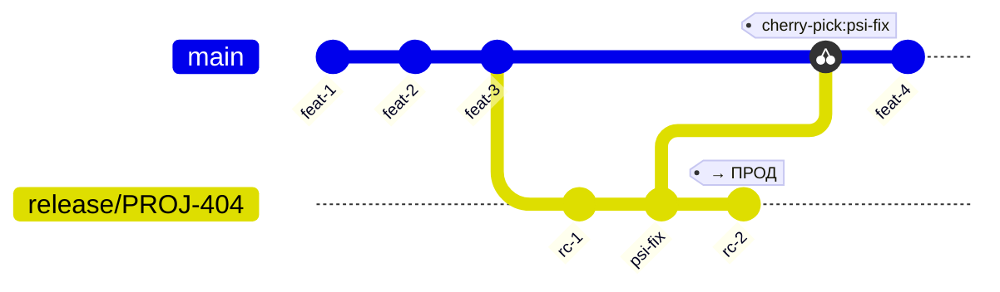
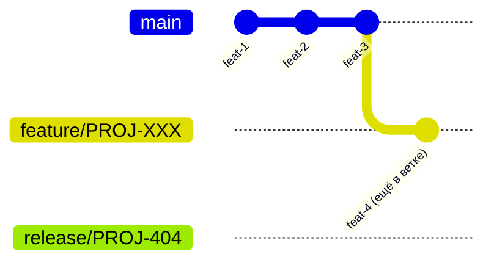
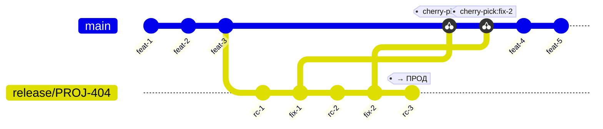
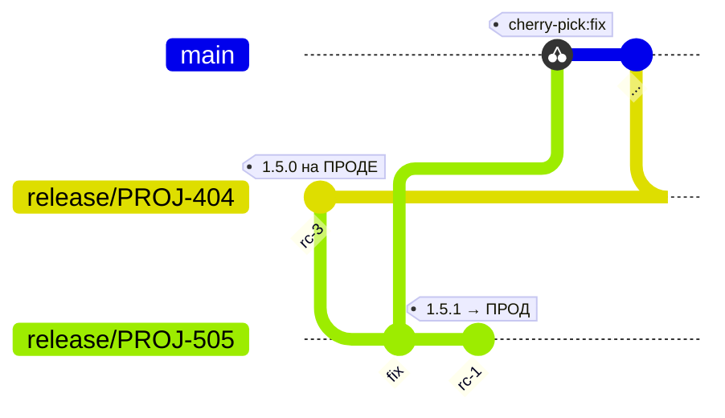
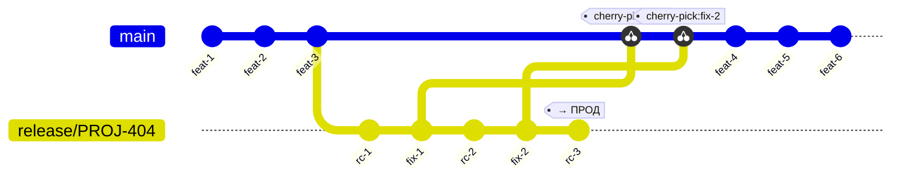
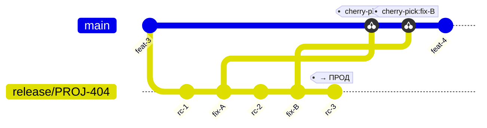

# Модель ветвления (Coin)

Версию артефактов ведёт **Coin** — она вычисляется из Git. Модель ветвления — **часть контракта**: имя ветки и наличие тега напрямую определяют `COIN_VERSION` и право на публикацию. Разработчик не задаёт версию в сборщике — он выбирает правильную ветку.

---

## Формат версий

```
major.minor.patch-JIRA-ID-[rc|snapshot]-N
```

| Квалификатор | С какой ветки | N | Пример |
|---|---|---|---|
| `snapshot` | **любая** ветка | auto-increment по серии | `1.5.0-PROJ-101-snapshot-3` |
| `rc` | **только `release/*`** | auto-increment по серии | `1.5.0-PROJ-404-rc-1` |

Теги создаются командой `coin version bump`. Coin ищет последний тег в серии (`major.minor.patch-JIRA-ID-{type}-*`) и увеличивает N на 1. Первый тег серии получает N=1.

**Правила:**

- **`rc`** выпускается **только с ветки `release/*`**. `coin version bump --type rc` на любой другой ветке вернёт ошибку.
- **`snapshot`** (по умолчанию) выпускается с любой ветки. Не является релизным артефактом, не деплоится на прод.
- Если для текущего (`JIRA-ID`, тип) уже есть серия — `bump` продолжает её (same base, N+1). Это обеспечивает итерации ПСИ: `rc-1` → `rc-2` → `rc-3` без смены базовой версии.
- `major.minor.patch` при старте новой серии берётся из последнего тега в репо плюс указанный уровень bump. Нет тегов вообще — база `0.0.0` + bump (первый `bump patch` → `0.0.1`).
- `JIRA-ID` извлекается из имени ветки (`release/PROJ-404` → `PROJ-404`). Для `main` — литерал `main`.
- **RC-тег = финальный артефакт.** Тот дистрибутив, что прошёл ПСИ, идёт на прод без пересборки.
- Git-тег несёт префикс `v` (`v1.5.0-PROJ-404-rc-1`), а `COIN_VERSION` внутри артефакта — без него (`1.5.0-PROJ-404-rc-1`).
- `coin version` без аргументов показывает последнюю версию из тегов. Нет тегов — `0.0.1`.

---

## Принятая модель: trunk-based

Одна долгоживущая ветка `main` (или `master` — зависит от соглашения репозитория; далее в документе используется `main`). Короткоживущие ветки от неё, релиз закрывается **тегом** через `coinRelease`.



---

## Именование веток

```
<тип>/<JIRA-ID>[-slug]
```

| Тип | Пример | Назначение |
|-----|--------|------------|
| `feature/` | `feature/PROJ-101` | новая функциональность |
| `bugfix/` | `bugfix/PROJ-202` | исправление бага до релиза |
| `release/` | `release/PROJ-404` | стабилизация + ПСИ + выпуск RC |

**Правила:**

- Обязательная часть — **тип + Jira ID**. Jira ID всегда стоит первым после типа.
- Опционально можно добавить короткий slug через дефис для читаемости: `feature/PROJ-101-login`.
- Нельзя: версию в имени (`feature/v1.5-login`), ветку без Jira ID (`feature/my-cool-thing`), тип `hotfix/`.
- ✅ Верно: `feature/PROJ-101`, `feature/PROJ-101-login`, `release/PROJ-404`
- ❌ Неверно: `feature/v1.5-login`, `feature/add-login`, `release/1.5.0`
- Версию в имя ветки не пишем — версия живёт в теге, не в ветке.

> Coin парсит из имени ветки только **тип** и **Jira ID** (до первого дефиса после ID).
> Slug игнорируется при расчёте `COIN_VERSION`, но остаётся в логах для читаемости.

---

## Ветки и версии

| Ветка / ситуация | `coin version` | После `coin version bump patch` |
|---|---|---|
| Новый проект, нет тегов | `0.0.1` | `v0.0.1-PROJ-101-snapshot-1` |
| `feature/PROJ-101`, есть `v0.0.1-PROJ-101-snapshot-2` | `0.0.1-PROJ-101-snapshot-2` | `v0.0.1-PROJ-101-snapshot-3` |
| `release/PROJ-404`, нет RC-тегов | `0.0.1` | `v0.0.2-PROJ-404-snapshot-1` |
| `release/PROJ-404` + `v1.5.0-PROJ-404-rc-2` | `1.5.0-PROJ-404-rc-2` | `v1.5.0-PROJ-404-rc-3` (с `--type rc`) |
| `main`, нет тегов | `0.0.1` | `v0.0.1-main-snapshot-1` |

> Базовая версия (`major.minor.patch`) вычисляется из последнего тега в репо.  
> Нет тегов вообще — база `0.0.0`, первый `bump patch` даёт `0.0.1`.

---

## Жизненный цикл фичи

1. От `main` создаётся `feature/PROJ-101`.
2. Коммиты → snapshot-сборки (`0.0.0-PROJ-101-snapshot-N`), без публикации.
3. PR в `main` → code review + Quality Gate → merge.

> Фича мержится в `main` только когда **готова ехать в ближайший релиз**.  
> Незаконченная фича остаётся в ветке — в `main` не идёт.

---

## Жизненный цикл релиза (с ПСИ)

### Шаг 1 — Фиче-фриз и создание release-ветки

Нужные фичи (1, 2, 3) уже в `main`. Ненужная (4) — ещё в своей ветке.



От `main` режется `release/PROJ-404`. `main` **сразу размораживается** — команда продолжает работу.

### Шаг 2 — Первый RC на ПСИ

`coinRelease` ставит тег → Coin собирает → уходит на ПСИ:

```
coinRelease --base 1.5.0  →  тег v1.5.0-PROJ-404-rc-1  →  ПСИ
```

### Шаг 3 — Итерации ПСИ

Нашли замечание → фикс идёт **только в `release/PROJ-404`** (не в `main` напрямую).

Каждая итерация = отдельный коммит + следующий RC-тег:

```
1.5.0-PROJ-404-rc-1  →  ПСИ → замечание → фикс
1.5.0-PROJ-404-rc-2  →  ПСИ → замечание → фикс
1.5.0-PROJ-404-rc-3  →  ПСИ → ПРИНЯТО ✓
```

**`1.5.0-PROJ-404-rc-3` = финальный дистрибутив.** Пересборки нет.

**Каждый коммит в `release/*`** (фикс, доработка, правка конфига — что угодно) **должен быть cherry-pick'нут в `main`** сразу после появления. Иначе следующий релиз выйдет без этих изменений.

> 🔧 **Готовится к автоматизации в Coin** — см. раздел [Cherry-pick фиксов в main](#cherry-pick-фиксов-в-main-туториал) ниже.

### Шаг 4 — Деплой на прод

Принятый артефакт деплоится на прод. После успешного деплоя **ветка `release/PROJ-404` удаляется**.

```bash
git push origin --delete release/PROJ-404
```

**Зачем удалять, а не оставлять?**

- Тег `v1.5.0-PROJ-404-rc-3` навсегда фиксирует нужный коммит — ветка для этого не нужна.
- Живые `release/*` ветки означают «идёт ПСИ». Завершённый релиз в этом списке создаёт путаницу.
- Ограничение «не более одной активной `release/*`» проще контролировать, когда старые удалены.

> Если нужно вернуться к коду этого релиза — используй тег:
> ```bash
> git checkout v1.5.0-PROJ-404-rc-3
> ```

### Итог потока



---

## Срочный фикс прода

Прод работает на `1.5.0-PROJ-404-rc-3`. Нашли критичный баг.

1. От тега `v1.5.0-PROJ-404-rc-3` создаётся ветка **`release/PROJ-505`**.
2. Фикс применяется прямо в ней + cherry-pick в `main`.
3. `coinRelease --base 1.5.1` → `v1.5.1-PROJ-505-rc-1` → деплой.



Почему `1.5.1`? Фикс прода = новая патч-версия. Это сигнал в changelog: не итерация ПСИ, а отдельный выпуск.

**Почему нет отдельного типа `hotfix/`?**

Потому что срочный фикс прода — это полноценный релиз, а не особый случай.

Он проходит тот же путь: фикс → RC-тег → ПСИ → деплой на прод. Единственное отличие от обычного релиза — это *патч-версия* (`1.5.1` вместо `1.6.0`) и *короткий цикл* ПСИ. Сам механизм — идентичный.

Если ввести `hotfix/`, Coin должен будет знать, что с неё тоже можно выпускать RC. Тогда правило «только `release/*` → RC» перестаёт быть простым и однозначным. Появляются исключения, путаница, риск ошибки.

Вместо этого используем `release/<JIRA-ID>` для любого релиза — планового или срочного. Различить их можно по типу Jira-тикета (Bug, Incident) и по патч-версии в теге. Coin при этом остаётся с одним простым правилом без исключений.

---

## Параллельная разработка

Наличие активной `release/PROJ-404` не блокирует команду:



Фичи 4, 5, 6 разрабатываются параллельно с ПСИ. Попадут в `release/PROJ-500`.

> **Ограничение:** не более одной активной `release/*` одновременно —
> два потока cherry-pick сложно контролировать.

---

## Cherry-pick коммитов из release в main (туториал)

> 🔧 **Этот процесс готовится к автоматизации в Coin.**  
> Сейчас выполняется вручную. В будущем `coin release cherry-pick` сделает это автоматически
> сразу после успешного тега RC.

### Зачем это нужно

Любые изменения вносятся в `release/*` — `main` про них не знает. Если не сделать cherry-pick, следующий релиз выйдет без этих изменений. Это касается **любого коммита**: фикс по ПСИ, доработка логики, правка конфигурации, обновление зависимости — всего.

### Когда делать

Сразу после появления коммита в `release/*` — **до** выпуска следующего RC.  
Не копить: чем больше коммитов накопилось, тем выше риск конфликта.

### Как делать (шаг за шагом)

**1. Узнай SHA нужного коммита**

```bash
git log --oneline release/PROJ-404
# например: a1b2c3d fix: null pointer in payment handler
#           b4c5d6e chore: update timeout config
```

**2. Переключись на main и подтяни изменения**

```bash
git checkout main
git pull origin main
```

**3. Сделай cherry-pick**

```bash
git cherry-pick a1b2c3d
```

Если конфликтов нет — сразу переходи к шагу 4.  
Если есть конфликт:

```bash
# разреши конфликты в файлах, затем:
git add .
git cherry-pick --continue
```

**4. Запушь в main**

```bash
git push origin main
```

**5. Убедись, что коммит появился в main**

```bash
git log --oneline main | head -5
```

### Что делать если cherry-pick уже потерян

Если несколько итераций ПСИ накопились без cherry-pick и в `main` нет этих фиксов:

1. Посмотри все коммиты `release/*`, которых нет в `main`:

   ```bash
   git log main..release/PROJ-404 --oneline
   ```

2. Cherry-pick каждого в хронологическом порядке (от старых к новым).

3. При конфликтах — разбирай вручную, не используй `--strategy-option=theirs` без понимания.

### Диаграмма



### Будущая автоматизация

Планируется команда `coin release cherry-pick`:

```
coin release cherry-pick \
  --from release/PROJ-404 \
  --to main \
  --since v1.5.0-PROJ-404-rc-1
```

Coin найдёт все коммиты `release/*` после указанного тега, которых ещё нет в `main`, и применит их последовательно. При конфликте — остановится и выведет инструкцию.

---

## Release Notes

Release notes считаются от последнего продакшн-тега предыдущей серии до текущего RC:

```
git log v1.4.0-PROJ-300-rc-2..v1.5.0-PROJ-404-rc-3
  → все тикеты из smart commits → release notes
```

Так все итерации одной серии (`rc-1`, `rc-2`, `rc-3`) всегда несут **полный контент** — независимо от числа итераций ПСИ. `coinRelease` вычисляет базовый тег автоматически (последний RC из другой `major.minor` серии).

---

## Как ставится тег: coin version bump

Теги ставит **только Coin pipeline**. Руками не тегируем.

```bash
# Jenkins job coinRelease вызывает:
coin version bump <level> --type rc
```

Что происходит под капотом:

```
coin version bump minor --type rc   (на ветке release/PROJ-404)
  │
  1. Проверяет, что ветка — release/*     ← иначе ошибка
  2. Определяет JIRA-ID из имени ветки → PROJ-404
  3. Ищет существующую серию v*-PROJ-404-rc-*
     ├── Серия есть (v1.5.0-PROJ-404-rc-1) → продолжает: v1.5.0-PROJ-404-rc-2
     └── Серии нет → берёт последний base, применяет bump minor → v0.2.0-PROJ-404-rc-1
  4. Ставит тег на HEAD + git push tag
  │
  multibranch pipeline ловит тег → собирает → публикует
```

### Выбор уровня bump

| Ситуация | Команда | Первый тег |
|---|---|---|
| Первый релиз (patch) | `bump patch --type rc` | `v0.0.1-PROJ-404-rc-1` |
| Новая фича (minor) | `bump minor --type rc` | `v0.1.0-PROJ-500-rc-1` |
| Breaking change (major) | `bump major --type rc` | `v1.0.0-PROJ-600-rc-1` |
| Итерация ПСИ | `bump patch --type rc` | продолжает серию → `rc-2`, `rc-3`, … |
| Срочный патч прода | `bump patch --type rc` (на `release/PROJ-505`) | `v0.0.2-PROJ-505-rc-1` |

*Ориентир выбора уровня: «Потребителю надо что-то менять у себя? → major. Просто получит новое? → minor. Вообще не заметит? → patch.»*

> **Итерации ПСИ** (rc-1 → rc-2 → rc-3) не меняют базовую версию.
> Coin видит существующую серию для данного JIRA-ID и продолжает её независимо от указанного уровня bump.

### Типичные сценарии

| Ситуация | Ветка | Команда → тег |
|---|---|---|
| Первая отдача на ПСИ | `release/PROJ-404` | `bump minor --type rc` → `v0.1.0-PROJ-404-rc-1` |
| Фикс по итогам ПСИ | `release/PROJ-404` | `bump patch --type rc` → `v0.1.0-PROJ-404-rc-2` |
| Ещё один фикс | `release/PROJ-404` | `bump patch --type rc` → `v0.1.0-PROJ-404-rc-3` |
| Срочный фикс прода | `release/PROJ-505` | `bump patch --type rc` → `v0.0.2-PROJ-505-rc-1` |

---

## Когда Coin публикует артефакт в Nexus

По умолчанию Coin **не публикует** каждую сборку. Поведение задаётся параметром `pipeline.publish.when` в `.coin/config.yaml`.

### Варианты

**`tag`** — публиковать только когда на коммите стоит RC-тег.

Это рекомендуемый вариант для большинства сервисов. Сборки на feature/bugfix ветках собираются, тестируются, но в Nexus не попадают. В Nexus появляется только то, что готово к деплою.

```yaml
pipeline:
  publish:
    when: tag   # публикация только на v*-rc-* теге
```

**`branch`** — публиковать snapshot с конкретной ветки (обычно `main`).

Используется, если команде нужна нестабильная сборка `main` в Nexus — например, для внутренней интеграции между сервисами до релиза.

```yaml
pipeline:
  publish:
    when: branch
    branch: main
```

**`always`** — публиковать при каждом пуше в любую ветку.  
**`never`** — не публиковать никогда (только сборка и тесты).

Оба редких случая — для вспомогательных пайплайнов (библиотеки, инструменты).

### Что выбрать

| Тип проекта | Рекомендация |
|---|---|
| Боевой сервис | `tag` |
| Shared-библиотека, которую потребляют другие сервисы | `tag` или `branch: main` |
| Инфраструктурный скрипт / утилита | `never` или `tag` |

---

## Чего разработчик НЕ делает

- Не задаёт версию в Gradle/Maven/uv/Go — это делает Coin из Git.
- Не запускает `coinRelease` вне ветки `release/*` — Coin вернёт ошибку.
- Не пересобирает дистрибутив после ПСИ — принятый RC идёт на прод как есть.
- Не публикует релиз из произвольной ветки в обход тега.
- Не мержит `release/*` целиком обратно в `main` — только cherry-pick конкретных фиксов.
- Не мержит незаконченную фичу в `main` если она не едет в ближайший релиз.
- Не пишет версию или описание в имя ветки — только тип + Jira ID.
