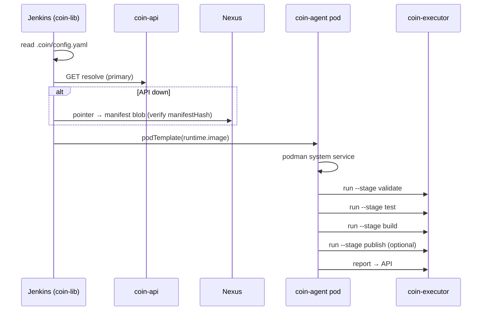

# Control Plane v2

Три слоя источника правды и runtime на `coin-executor`.

## Три слоя

| Слой | Где | Что хранит |
|------|-----|------------|
| **Content** | PostgreSQL + Nexus | gp-content blobs (Containerfile, schema), component artifacts |
| **Metadata** | PostgreSQL | GP releases, composition, catalog policy, audit |
| **Runtime cache** | Nexus `maven-releases` / `maven-snapshots` | immutable manifest blobs + mutable pointers |

Manifest — **канонический JSON** с `manifestHash` (sha256). Собирается coin-api при Resolve и кешируется в Nexus.

## Компоненты

| Компонент | Роль |
|-----------|------|
| **coin-api** | Resolve manifest, registry, GP admin, build report |
| **coin-executor** | `validate`, `run --stage`, `publish`, `report` |
| **coin-gp-content** | Authoring GP stacks → publish в Nexus |
| **coin-lib** | Jenkins glue (resolve, pod, stages) |
| **coin-ui** | Admin SPA |

## Manifest (v1, сокращённо)

```json
{
  "manifestVersion": 1,
  "manifestHash": "sha256:…",
  "goldenPath": { "name": "go-app", "version": "1.0.2" },
  "executor": {
    "version": "0.1.0",
    "url": "http://nexus:8081/repository/maven-releases/coin/executor/coin-executor/0.1.0/coin-executor-0.1.0-linux-arm64"
  },
  "runtime": {
    "image": "nexus:8082/coin-docker/coin-agent:1.0.0"
  },
  "build": {
    "engine": "buildkit",
    "buildkit": {
      "dockerfile": ".coin/Containerfile",
      "targets": {
        "validate": "validate",
        "test": "test",
        "image": "runtime",
        "artifact": "artifact"
      },
      "containerfile": { "url": "…", "sha256": "sha256:…" }
    }
  },
  "validateSchema": {
    "url": "http://nexus:8081/repository/maven-releases/coin/gp/content/go-app/1.0.2/config.v2.schema.json",
    "sha256": "sha256:…"
  },
  "pipeline": {
    "stages": [
      { "id": "validate", "name": "Validate" },
      { "id": "test", "name": "Test" },
      { "id": "build", "name": "Build" },
      { "id": "publish", "name": "Publish", "when": "tag" }
    ]
  },
  "credentials": { "docker": "nexus-docker" }
}
```

**Superseded в manifest:** `dockerfileTemplate`, `pipeline.stages[].script`, `manifest.jnlp`, orchestration bundle URL.

OpenAPI: [`coin-api/openapi/v1.yaml`](../coin-api/openapi/v1.yaml).  
Schema: [`coin-api/manifest.schema.json`](../coin-api/manifest.schema.json).

## CI flow



Build dispatch по `manifest.build.engine` — см. [agent-build-model.md](agent-build-model.md).

## Миграция с v1

Config v1 (`template`/`templateVersion`, fat pipeline, Shared Library business logic) **выведен**. См. [migrate-config-v1-to-v2.md](how-to/migrate-config-v1-to-v2.md).

ADR: [`.cursor/plans/adr/control-plane-v2.md`](../.cursor/plans/adr/control-plane-v2.md).
