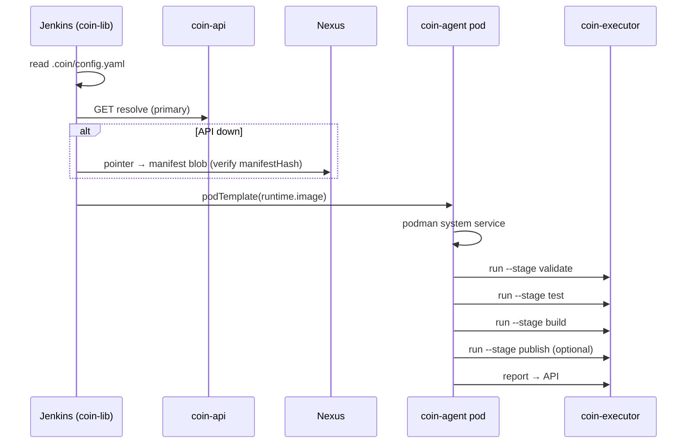

# Control Plane v2

Три слоя источника правды, **platform components** (UI-first) и runtime на `coin-executor`.

## Три слоя

| Слой | Где | Что хранит |
|------|-----|------------|
| **Content** | Nexus (+ PG draft bodies в Studio) | gp-content packages, executor binary, manifest blobs; coin-lib ZIP — вне PG registry |
| **Metadata** | PostgreSQL | `component_versions`, GP releases, composition, catalog policy, audit |
| **Runtime cache** | Nexus `maven-releases` / `maven-snapshots` | immutable manifest blobs + mutable pointers |

**Q1 (platform lead):** `component_artifact_bodies` — только **draft** в Component Studio. Published/canary — **Nexus-only** (без dual-write тел в PG).

Manifest — **канонический JSON** с `manifestHash` (sha256). Собирается coin-api при Resolve из composition slots + materializers и кешируется в Nexus.

Миграция legacy dual-write (`gp_artifact_bodies`): [runbooks/gp-artifact-bodies-migration.md](runbooks/gp-artifact-bodies-migration.md).

## Platform components (UI-first)

Enabling team выпускает platform content через **coin-ui Component Studio** (`/studio`) → Admin API → Nexus → registry.

| Роль | Путь |
|------|------|
| **Primary** | Component Studio → validate → register package → publish canary → promote stable |
| **GP pin** | coin-ui Catalog / Admin API — composition в `gp_releases` |
| **Promote** | `/promote` — catalog `latest_canary` → `latest` + component promote |
| **Deprecated** | `publish-*.sh`, Gitea platform jobs, `make coin-lib` (Gitea SCM) |

### Lifecycle (`component_versions`)

| State | Product resolve (stable) | Canary channel | Studio edit |
|-------|--------------------------|----------------|-------------|
| `draft` | ❌ | ❌ | ✅ |
| `canary` | ❌ (кроме pilot GP) | ✅ | ❌ |
| `published` | ✅ | ✅ | ❌ |

Переходы: `draft` → **publish to canary** → **promote stable** (после health gate на pilot projects).

ADR: [adr/gp-component-package-model.md](adr/gp-component-package-model.md).

## Компоненты

| Компонент | Роль |
|-----------|------|
| **coin-api** | Resolve manifest, registry, GP admin, component lifecycle, build report |
| **coin-executor** | `validate`, `run --stage`, `publish`, `report` |
| **coin-gp-content** | Reference stacks; primary authoring — Component Studio |
| **coin-lib** | Jenkins glue (resolve, pod, stages); ZIP из Nexus HTTP |
| **coin-ui** | Admin SPA + Component Studio + promote wizard |

## Manifest (v1, сокращённо)

```json
{
  "manifestVersion": 1,
  "manifestHash": "sha256:…",
  "goldenPath": { "name": "go-app", "version": "1.0.2" },
  "executor": {
    "version": "0.1.0",
    "url": "http://nexus:8081/repository/maven-releases/coin/executor/coin-executor/0.1.0/coin-executor-0.1.0-linux-arm64",
    "sha256": "sha256:…"
  },
  "runtime": {
    "image": "nexus:8082/coin-docker/coin-agent:1.0.0",
    "digest": "sha256:…"
  },
  "lib": {
    "name": "coin-lib",
    "version": "1.0.0",
    "url": "http://nexus:8081/repository/maven-releases/coin/lib/coin-lib/1.0.0/coin-lib-1.0.0.zip",
    "sha256": "sha256:…"
  },
  "build": {
    "engine": "buildkit",
    "buildkit": {
      "dockerfile": ".coin/Containerfile",
      "targets": {
        "validate": "validate",
        "test": "test",
        "image": "runtime",
        "artifact": "artifact"
      },
      "containerfile": { "url": "…", "sha256": "sha256:…" }
    }
  },
  "validateSchema": {
    "url": "http://nexus:8081/repository/maven-releases/coin/gp/content/go-app/1.0.2/config.v2.schema.json",
    "sha256": "sha256:…"
  },
  "pipeline": {
    "stages": [
      { "id": "validate", "name": "Validate" },
      { "id": "test", "name": "Test" },
      { "id": "build", "name": "Build" },
      { "id": "publish", "name": "Publish", "when": "tag" }
    ]
  },
  "credentials": { "docker": "nexus-docker" }
}
```

**Superseded в manifest:** `dockerfileTemplate`, `pipeline.stages[].script`, `manifest.jnlp`, orchestration bundle URL.

OpenAPI: [`coin-api/openapi/v1.yaml`](../coin-api/openapi/v1.yaml).  
Schema: [`coin-api/manifest.schema.json`](../coin-api/manifest.schema.json).

## Resolve materializers

coin-api собирает manifest через **composition slot registry** (не switch per type):

1. `gp_composition` → pin component type/name/version per slot
2. Materializer загружает package / metadata (`content_ref` v2 или legacy)
3. `manifest.Builder` денормализует секции (`build`, `pipeline`, `lib`, …)

CI fallback при недоступном API — **только Nexus** (manifest blob + component packages), не PG bodies.

## CI flow



Build dispatch по `manifest.build.engine` — см. [agent-build-model.md](agent-build-model.md).

## Миграция с v1

Config v1 (`template`/`templateVersion`, fat pipeline, Shared Library business logic) **выведен**. См. [migrate-config-v1-to-v2.md](how-to/migrate-config-v1-to-v2.md).

ADR: [`docs/adr/control-plane-v2.md`](adr/control-plane-v2.md).
