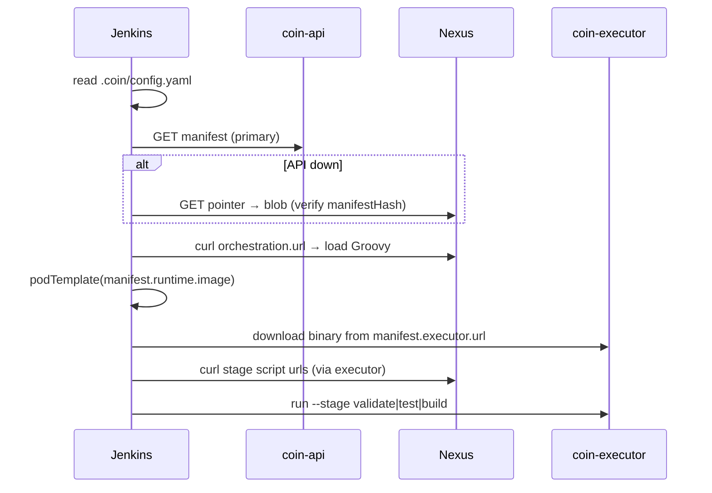

# Control Plane v2

Три слоя источника правды и два runtime-компонента.

## Три слоя

| Слой | Где | Что хранит |
|------|-----|------------|
| **Content** | PostgreSQL + Nexus `content/` | scripts, Dockerfile, schema, orchestration |
| **Metadata** | PostgreSQL | GP releases, composition, catalog policy |
| **Runtime cache** | Nexus `coin-manifests` | immutable manifest blobs + mutable pointers |

Manifest — **канонический JSON** с `manifestHash` (sha256). Собирается coin-api при Resolve и кешируется в Nexus.

## Компоненты

| Компонент | Роль |
|-----------|------|
| **coin-api** | `GET /v1/golden-paths/{name}/versions/{ver}/manifest`, health, (P1+) report/admin |
| **coin-executor** | `validate`, `run --stage`, `bootstrap`, `report` |
| **coin-ui** | Admin SPA (фаза 2) |

## Manifest (сокращённо)

```json
{
  "manifestVersion": 1,
  "manifestHash": "sha256:…",
  "goldenPath": { "name": "go-app", "version": "1.0.0" },
  "executor": { "version": "0.1.0", "url": "http://nexus:8081/repository/coin-executor/0.1.0/coin-executor-linux-arm64" },
  "runtime": { "image": "nexus:8082/coin-docker/ci-go:1.22-r2" },
  "pipeline": { "stages": [ … ] },
  "orchestration": { "url": "http://nexus:8081/repository/coin-manifests/content/go-app/1.0.0/orchestration/coinPipeline.groovy", "sha256": "…" },
  "dockerfileTemplate": { "url": "…", "sha256": "…" },
  "credentials": { "docker": "nexus-docker" }
}
```

OpenAPI: [`coin-api/openapi/v1.yaml`](../coin-api/openapi/v1.yaml).  
Schema: [`coin-api/manifest.schema.json`](../coin-api/manifest.schema.json).

## CI flow



## Миграция с v1

Config v1 (`template`/`templateVersion`, Shared Library pipeline) **выведен**. См. [migrate-config-v1-to-v2.md](how-to/migrate-config-v1-to-v2.md).

ADR: [`.cursor/plans/adr/control-plane-v2.md`](../.cursor/plans/adr/control-plane-v2.md).
