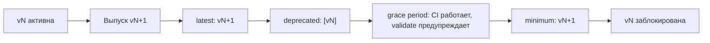

# Версионирование каталога golden paths

Как Coin доставляет и версионирует каталог `coin-golden-paths/` — отдельно от версии **coin-cli** и **образа Jenkins agent**.

---

## Три слоя доставки (пилот)

| Слой | Частота обновлений | Источник | Pin для продукта |
|------|-------------------|----------|------------------|
| **Runtime agent image** | Редко | `agents/catalog.yaml` + `agents-build` | `profile.agent.rev` |
| **coin-cli** | Часто | Nexus Maven zip | `profile.coinCli.version` |
| **Golden paths catalog** | Очень часто | `coin-platform/golden-paths/` | `coin.templateVersion` |

Продуктовый репозиторий задаёт только **`coin.template` + `coin.templateVersion`**.  
Все platform pin'ы (CLI, agent rev, scripts, Dockerfile) — в **`golden-paths/<name>/<ver>/profile.yaml`**.

### Platform bundle (profile.yaml)

```yaml
agent:
  stack: python-uv
  runtime:
    python: "3.13"
  rev: 0
coinCli:
  version: "0.0.0-SNAPSHOT"
build:
  type: container
  ...
```

| Изменение | Действие |
|-----------|----------|
| Patch/minor CLI (совместимо) | bump `coinCli.version` в **текущем** `vN` |
| Major CLI / breaking контракт | новый **`vN+1/`** + миграция `templateVersion` |
| Пересборка agent (тот же runtime) | bump `agent.rev` в profile |
| Смена runtime (Go 1.22→1.23) | обычно новый **`vN+1/`** |

Rollout: `coin-cli` job → Nexus; `agents-build` → Docker + `catalog.yaml`; bump profile в `coin-platform`; продукты подхватывают на следующем build.

`coin platform validate` проверяет `coinCli.version`, `agent.rev` и связь с `agents/catalog.yaml`.

Golden paths **не** вшиваются в бинарь CLI — только внешний каталог (local / Nexus).

---

## Версии профиля: v1, v2, …

```
coin-golden-paths/
  catalog.yaml              # policy: latest, minimum
  _shared/
    pack-image.sh           # docker/kaniko после native build
  python-uv-app/
    v1/
      profile.yaml
      Dockerfile            # runtime-only
      scripts/
      config.yaml
    v2/
      ...
```

| Уровень | Формат | Когда менять |
|---------|--------|--------------|
| Major профиля | `v1` → `v2` | Breaking: другой build.type, другой publish, смена base image |
| Minor/patch | внутри `v1/` | Новые скрипты, правки Dockerfile без смены контракта |

В `.coin/config.yaml` проекта:

```yaml
coin:
  template: python-uv-app
  templateVersion: v1        # зафиксировано командой
```

Если `templateVersion` пуст — CLI берёт `latest` из `catalog.yaml`.

---

## catalog.yaml

```yaml
python-uv-app:
  stack: python-uv
  latest: v2
  minimum: v1
  deprecated: [v0]
```

| Поле | Назначение | Блокирует pipeline |
|------|------------|-------------------|
| **`latest`** | рекомендуемая версия для новых проектов и `coin init` | нет (только подсказка) |
| **`deprecated`** | версии, с которых пора мигрировать | нет (только `⚠` в `coin validate`) |
| **`minimum`** | нижняя допустимая версия профиля | **да** — `validate` и `run` падают |

Поле **`deprecated`** — список снятых с поддержки версий профиля (`v0`, `v1`, …) внутри записи golden path.

`coin validate`:
- проверяет, что версия существует;
- предупреждает, если `latest` новее текущей;
- предупреждает (не падает), если `templateVersion` входит в `deprecated`;
- падает, если версия ниже `minimum`.

---

## Жизненный цикл версии профиля

Снятие версии — **двухступенчатый** процесс: сначала мягкое предупреждение, потом жёсткая блокировка.



### Пример: снятие v1 после выпуска v2

**Шаг 1 — новая версия, старая ещё допустима**

```yaml
python-uv-app:
  latest: v2
  minimum: v1
  deprecated: [v0]
```

Команды на v1 работают без предупреждений. Новые проекты через `coin init` получают v2.

**Шаг 2 — deprecation (grace period)**

```yaml
python-uv-app:
  latest: v2
  minimum: v1
  deprecated: [v0, v1]
```

- `coin validate` → `⚠ deprecated: версия v1 снята с поддержки — перейдите на v2`
- `coin run test/build/publish` — **ещё работает**

**Шаг 3 — enforcement (hard cut-off)**

```yaml
python-uv-app:
  latest: v2
  minimum: v2
  deprecated: [v0, v1]
```

Любая команда с `templateVersion: v1` падает: версия ниже `minimum`. К этому моменту команды должны уже мигрировать.

| Этап | Изменение в catalog | Эффект |
|------|---------------------|--------|
| Релиз v2 | `latest: v2` | новые проекты на v2 |
| Deprecation | `deprecated: [v1]` | предупреждение в validate |
| Enforcement | `minimum: v2` | блокировка v1 везде |

`deprecated` без поднятия `minimum` **не блокирует** pipeline — только даёт время на миграцию.

---

## Источники каталога (env)

| Переменная | Значение | Описание |
|------------|----------|----------|
| `COIN_GOLDEN_PATHS_SOURCE` | `local` (default) | Локальный каталог |
| | `nexus` / `url` | Скачать tarball по URL |
| `COIN_GOLDEN_PATHS_DIR` | путь | Явный путь к `coin-golden-paths/` |
| `COIN_GOLDEN_PATHS_URL` | URL | Tarball для `nexus` source |

Кеш при fetch: `.coin/cache/golden-paths/`.

**Сейчас:** каталог рядом с монорепо (разработка) или tarball из Nexus (CI).

---

## Связанные документы

- [agent-build-model.md](agent-build-model.md) — сборка app vs agent image
- [golden-paths.md](golden-paths.md) — матрица golden paths
- [config.md](config.md) — поля `coin.template` / `templateVersion`
- [architecture.md](architecture.md) — компоненты и доставка
