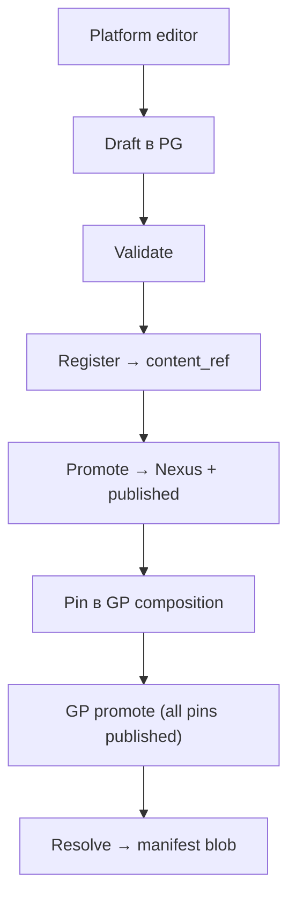
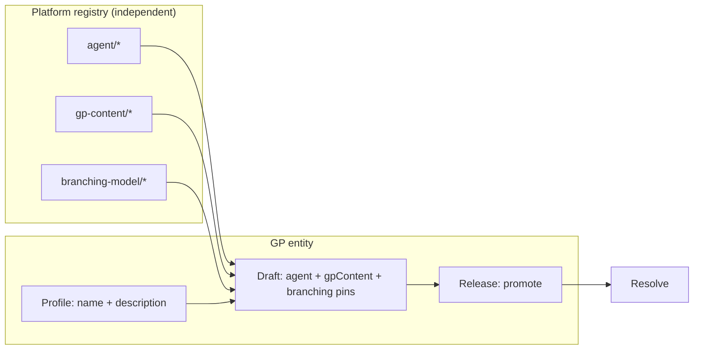

# Golden Paths (Control Plane v2)

## Модель

| Сущность | Описание |
|----------|----------|
| **Golden Path (GP)** | Именованный профиль: `go-app`, `go-app-docker`, … |
| **GP release** | Semver pin в продукте: `go-app@1.0.0` |
| **Platform component** | Версионируемый артефакт платформы (`gp-content`, `lib`, `agent`, …) |
| **Manifest** | JSON от Resolve: `build`, `runtime`, `pipeline`, `lib`, `validateSchema` |

Продукт указывает только:

```yaml
coin:
  goldenPath: go-app
  version: "1.0.0"
```

## Enabling team playbook

Единый путь выпуска platform content (UI-first):



| Шаг | UI / API | Результат |
|-----|----------|-----------|
| 1. Author | `/platform/build-stacks/.../edit`, `/platform/branching-models/.../edit` | `component_artifact_bodies` (draft) |
| 2. Register | Validate → Register package | PG `content_ref` v2 (без Nexus `package.url`) |
| 3. Publish | Promote component | Nexus upload + `component_versions.status = published` |
| 4. GP pin | GP hub draft | `gp_composition` (draft pins допустимы на canary line) |
| 5. GP promote | Release detail | GP `published`; gate — все pins `published` |

**Local bootstrap** (без UI): `make seed-jenkins-lib` — публикует lib + gp-content + GP profiles.  
**Deprecated:** `/studio`, `publish-canary`, `publish-content.sh`, `make coin-lib` (Gitea).

Platform types: `branching-model` (`model.yaml`), `gp-content` (`content.yaml` + Containerfile).

## Component lifecycle → GP composition



1. **Platform team** публикует `gp-content` и `branching-model` в registry (Studio / publish scripts) — **без** GP profile.
2. **Enabling team** создаёт GP profile (`name`, `description`) — identity для `coin.goldenPath` в product repos.
3. **Draft** выбирает из каталога: `agentStackName`, `gpContentName`, `branchingModelName` + versions. Имя profile **может отличаться** от `gpContentName` (например profile `xxx` → `go-app@1.0.0`).
4. **Resolve** мержит GP composition (3 pins) + derived executor из agent stack → manifest для coin-executor (без секции `lib`).
5. **Draft edit** — operator может менять composition pins на draft (`PATCH`); published immutable в Nexus.
6. **Draft deletion** — operator может удалить draft; published нельзя удалить.

## Composition (GP draft 3-pin)

**GP composition** (per release version, draft/promote) — 3 слота:

| Slot | Component type | Выбор | Manifest section |
|------|----------------|-------|------------------|
| `agent` | `agent` | `agentStackName` + version | `runtime` (+ executor derived) |
| `gp-content` | `gp-content` | `gpContentName` + version | `build`, `pipeline`, `validateSchema` |
| `branching-model` | `branching-model` | `branchingModelName` + version | `branching` |

При resolve coin-api **мержит** GP composition + executor из agent bundle → manifest для coin-executor.

**coin-lib** (Jenkins glue) — вне control plane: версия задаётся в Jenkins org (`@Library`), publish только в Nexus. См. [adr/jenkins-lib-outside-platform.md](adr/jenkins-lib-outside-platform.md).

GP profile (`gp_profiles`) — только `name` + optional `description`; **нет** связи profile ↔ build stack. gp-content pin виден на **release detail** (composition table).

Legacy 4-slot direct publish (bootstrap scripts) поддерживается для migration; новый UI — draft → promote only.

**Superseded:** platform lib pin; 2-slot GP; per-GP pins agent/executor/lib в profile slots; Build stack tab на GP hub.

## Component types (platform)

| Type | Authoring (primary) | Consumer |
|------|---------------------|----------|
| `gp-content` | Component Studio | coin-executor (`build`, stages) |
| `agent` | `publish-agent.sh` | Jenkins pod (`runtime`) |
| `executor` | `publish-executor.sh` | coin-agent (binary) |
| `branching-model` | Component Studio | coin-executor (`manifest.branching`) |

**Вне registry:** `coin-lib` — Nexus ZIP + Jenkins HTTP retriever ([ADR](adr/jenkins-lib-outside-platform.md)).

Package layout: `maven-releases/coin/{type}/{name}/{version}/package.manifest.json` + artifacts.

## Build engines (go family, local pilot)

| GP | `build.engine` | Sample repo | Jenkins job |
|----|----------------|-------------|-------------|
| `go-app` | `buildkit` | `samples/demo-go-app` | `demo-go-app` |
| `go-app-docker` | `dockerfile` (BYO) | `samples/demo-go-app-docker` | `demo-go-app-docker` |

Content SoT (reference + Studio export):

```
coin-gp-content/stacks/
├── go-app/content.yaml
└── go-app-docker/content.yaml
```

## Runtime pod

Один container — `manifest.runtime.image` (`coin-agent`), не отдельный stack agent.

См. [adr/coin-ci-runtime.md](adr/coin-ci-runtime.md).

## Pipeline stages

Typed stages в gp-content `content.yaml` — **без** script URLs:

```yaml
pipeline:
  stages:
    - id: validate
      name: Validate
    - id: test
      name: Test
    - id: build
      name: Build
    - id: publish
      name: Publish
```

Publish eligibility: Jenkins `params.publish` + `manifest.branching` (не `when: tag` в gp-content v2). Reference `content.yaml` может содержать legacy `when: tag` до change `gp-content-schema-v2`.

Orchestration — `coin-lib` + `coin-executor`, не Groovy/shell из Nexus.

## Seed и publish (local)

```bash
cd docker
make publish-agent GOARCH=arm64   # при необходимости
make seed-jenkins-lib             # lib ZIP + gp-content + GP + coin-lib-http
make samples
make e2e-build-engines            # acceptance 3/3
```

Новый gp-content / branching: **Component Studio** → canary → promote → обновить GP composition semver.

How-to: [publish-gp-release.md](how-to/publish-gp-release.md).

## Catalog (local pilot)

| GP | Typical pin | Notes |
|----|-------------|-------|
| `go-app` | `1.0.2` | buildkit + Containerfile fixes |
| `go-app-bp` | `1.0.0` | buildpack |
| `go-app-df` | `1.0.2` | dockerfile targets |

Продукты могут pin `1.0.0` если GP release опубликован; после content bump — новый GP semver.

Canary: `catalog.latest_canary`, `project.canary_mode`, заголовок `X-Coin-Channel`. См. [canary.md](canary.md).

## Связанные документы

- [control-plane.md](control-plane.md) — три слоя SoT, manifest, materializers
- [adr/gp-component-package-model.md](adr/gp-component-package-model.md) — package model, deprecations
- [runbooks/gp-artifact-bodies-migration.md](runbooks/gp-artifact-bodies-migration.md) — dual-write cleanup plan
- [golden-path-versioning.md](golden-path-versioning.md)
- [config.md](config.md)
