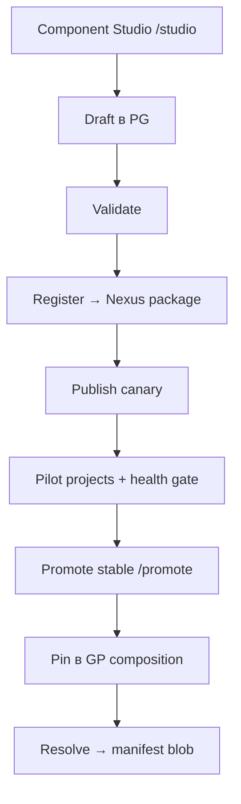

# Golden Paths (Control Plane v2)

## Модель

| Сущность | Описание |
|----------|----------|
| **Golden Path (GP)** | Именованный профиль: `go-app`, `go-app-bp`, `go-app-df`, … |
| **GP release** | Semver pin в продукте: `go-app@1.0.0` |
| **Platform component** | Версионируемый артефакт платформы (`gp-content`, `lib`, `agent`, …) |
| **Manifest** | JSON от Resolve: `build`, `runtime`, `pipeline`, `lib`, `validateSchema` |

Продукт указывает только:

```yaml
coin:
  goldenPath: go-app
  version: "1.0.0"
```

## Enabling team playbook

Единый путь выпуска platform content (UI-first):



| Шаг | UI / API | Результат |
|-----|----------|-----------|
| 1. Author | `/studio` — `branching-model`, `gp-content` | `component_artifact_bodies` (draft) |
| 2. Register | Validate → Register package | Nexus ZIP + `content_ref` v2 |
| 3. Canary | Publish to canary | `component_versions.status = canary` |
| 4. Promote | PilotPromotePanel / `/promote` | `published` + catalog latest |
| 5. GP pin | Catalog или Admin API | `gp_composition` + resolve |

**Local bootstrap** (без Studio): `make seed-jenkins-lib` — публикует lib + gp-content + GP profiles.  
**Deprecated:** `publish-content.sh`, `make coin-lib` (Gitea), embedded seed bytes.

Studio types: `branching-model` (`model.yaml`), `gp-content` (`content.yaml` + Containerfile).

## Composition (5 slots)

При publish GP release в manifest попадают:

| Slot | Component type | Пример | Manifest section |
|------|----------------|--------|------------------|
| `agent` | `agent` | `coin-agent@1.0.0` | `runtime.image` |
| `executor` | `executor` | `coin-executor@0.1.0` | `executor` |
| `lib` | `lib` | `coin-lib@1.0.0` | `lib` (Nexus ZIP ref) |
| `gp-content` | `gp-content` | `gp-content/go-app@1.0.2` | `build`, `pipeline`, `validateSchema` |
| `branching-model` | `branching-model` | `trunk-based@1.0.0` | `branching` |

Legacy 4-slot GP releases (без `branching-model` в composition) resolve без секции `branching` до re-publish.

**Superseded:** 5-slot с `jnlp` + `agent/{stack}`, slots `pipeline` / `validate` / `dockerfile` как отдельные component types.

## Component types (platform)

| Type | Authoring (primary) | Consumer |
|------|---------------------|----------|
| `gp-content` | Component Studio | coin-executor (`build`, stages) |
| `lib` | `publish-lib.sh` / future Studio | Jenkins `@Library` + manifest `lib` |
| `agent` | `publish-agent.sh` | Jenkins pod (`runtime`) |
| `executor` | `publish-executor.sh` | coin-agent (binary) |
| `branching-model` | Component Studio | coin-executor (`manifest.branching`) |

Package layout: `maven-releases/coin/{type}/{name}/{version}/package.manifest.json` + artifacts.

## Build engines (go family, local pilot)

| GP | `build.engine` | Sample repo | Jenkins job |
|----|----------------|-------------|-------------|
| `go-app` | `buildkit` | `samples/demo-go-app` | `demo-go-app` |
| `go-app-bp` | `buildpack` | `samples/demo-go-app-bp` | `demo-go-app-bp` |
| `go-app-df` | `dockerfile` | `samples/demo-go-app-df` | `demo-go-app-df` |

Content SoT (reference + Studio export):

```
coin-gp-content/stacks/
├── go-app/content.yaml       # buildkit
├── go-app-bp/content.yaml    # buildpack
└── go-app-df/content.yaml    # dockerfile
```

## Runtime pod

Один container — `manifest.runtime.image` (`coin-agent`), не отдельный stack agent.

См. [agent-build-model.md](agent-build-model.md).

## Pipeline stages

Typed stages в gp-content `content.yaml` — **без** script URLs:

```yaml
pipeline:
  stages:
    - id: validate
      name: Validate
    - id: test
      name: Test
    - id: build
      name: Build
    - id: publish
      name: Publish
      when: tag
```

Orchestration — `coin-lib` + `coin-executor`, не Groovy/shell из Nexus.

## Seed и publish (local)

```bash
cd docker
make publish-agent GOARCH=arm64   # при необходимости
make seed-jenkins-lib             # lib ZIP + gp-content + GP + coin-lib-http
make samples
make e2e-build-engines            # acceptance 3/3
```

Новый gp-content / branching: **Component Studio** → canary → promote → обновить GP composition semver.

How-to: [publish-gp-release.md](how-to/publish-gp-release.md).

## Catalog (local pilot)

| GP | Typical pin | Notes |
|----|-------------|-------|
| `go-app` | `1.0.2` | buildkit + Containerfile fixes |
| `go-app-bp` | `1.0.0` | buildpack |
| `go-app-df` | `1.0.2` | dockerfile targets |

Продукты могут pin `1.0.0` если GP release опубликован; после content bump — новый GP semver.

Canary: `catalog.latest_canary`, `project.canary_mode`, заголовок `X-Coin-Channel`. См. [canary.md](canary.md).

## Связанные документы

- [control-plane.md](control-plane.md) — три слоя SoT, manifest, materializers
- [adr/gp-component-package-model.md](adr/gp-component-package-model.md) — package model, deprecations
- [runbooks/gp-artifact-bodies-migration.md](runbooks/gp-artifact-bodies-migration.md) — dual-write cleanup plan
- [golden-path-versioning.md](golden-path-versioning.md)
- [config.md](config.md)
