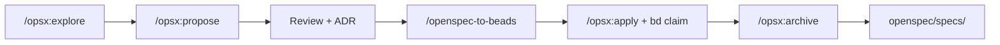

# Планирование Coin (OpenSpec + Beads)

С **июня 2026** весь backlog и активная разработка ведутся через **OpenSpec** и **Beads**. Каталог `.cursor/plans/` не используется.

## Где что лежит

| Слой | Путь | Роль |
|------|------|------|
| **ADR** | [`docs/adr/`](adr/) | Постоянные архитектурные решения |
| **OpenSpec change** | [`openspec/changes/<id>/`](../openspec/changes/) | Активная фича: proposal → design → specs → tasks |
| **Baseline specs** | [`openspec/specs/`](../openspec/specs/) | Требования после archive |
| **Beads** | `bd` / [`.beads/`](../.beads/) | Исполнение: epic, tasks, deps |
| **User docs** | [`docs/`](.) | How-to, architecture, runbooks |

## Workflow



| Команда | Когда |
|---------|-------|
| `/opsx:explore` | Исследование без кода |
| `/opsx:propose <name>` | Новый change |
| `/opsx:apply` | Реализация по `tasks.md` |
| `/openspec-to-beads` | Epic + tasks в Beads после approve |
| `/opsx:archive` | Завершённый change → baseline specs |
| `bd ready` | Готовые задачи без блокеров |

Правила: [plan-execution.mdc](../.cursor/rules/plan-execution.mdc)

## Активные changes

| Change | Статус | Зависимости |
|--------|--------|-------------|
| [gp-branching-model](../openspec/changes/gp-branching-model/) | **active** | gp-component-platform ✅ |

Завершённые — в [`openspec/changes/archive/`](../openspec/changes/archive/) (в т.ч. [gp-component-platform](../openspec/changes/archive/2026-06-23-gp-component-platform/)).

Стенд: http://localhost:8091 (`make coin-ui-up`), ключ `dev-local-admin-key`.

## Новый change

```bash
openspec new change <kebab-name>
# proposal → design → specs → tasks
openspec status --change <name>
```

После approve: `/openspec-to-beads <name>`
