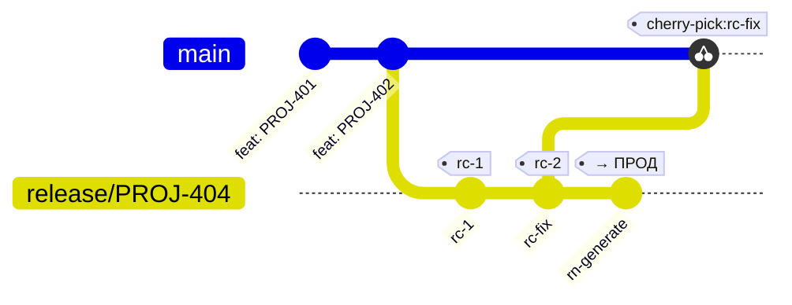

# Release Notes в Coin

Coin автоматически формирует release notes из git-истории и отправляет их во внутренний сервис QGM (Quality Gates Manager) через REST API.

---

## Концепция

Release notes — это структурированный документ, описывающий **что** вошло в конкретный дистрибутив:

- Jira-тикеты, связанные с релизом (smart-коммиты).
- Диапазон коммитов (первый и последний SHA).
- Участники разработки (по каждому тикету).
- Метаданные сборки (Jenkins job, ветка, время).

**Ключевое правило**: релиз в продакшн ≡ арtefact-тег в git ≡ release note в QGM.  
Пересборка невозможна без нового тега, а значит — без новой записи release notes.

---

## Как работают smart-коммиты

Coin сканирует сообщения git-коммитов в заданном диапазоне и извлекает Jira-тикеты по шаблону `[A-Z][A-Z0-9]+-\d+`.

```
feat(auth): добавить OAuth2 PROJ-123
fix: исправить NPE в обработчике MYTEAM-456 MYTEAM-457
```

Из таких коммитов в release notes попадут тикеты `PROJ-123`, `MYTEAM-456`, `MYTEAM-457`.  
Первая строка сообщения становится summary тикета.

---

## Конфигурация

Координаты артефакта задаются в `project:` — они используются во всех интеграциях.
Для release notes дополнительно нужна секция `rn:`.

```yaml
project:
  name: my-service              # → artifactId
  groupId: com.example.team     # → groupId в QGM
  repository: Nexus_PROD        # → repository в QGM

rn:
  serviceUrl: https://qgm.example.com
  # codeRepository: ssh://git@bitbucket.example.com/team/my-service.git
```

| Поле | Обязательно | Описание |
|------|-------------|----------|
| `project.name` | **Да** | Имя сервиса (`artifactId`). |
| `project.groupId` | **Да** | Домен команды (`groupId` в QGM). |
| `project.repository` | **Да** | Репозиторий Nexus (`repository` в QGM). |
| `rn.serviceUrl` | Нет* | URL QGM API. Нужен для `coin rn publish` (запланировано). |
| `rn.codeRepository` | Нет | URL git-репозитория. Авто из `git remote origin` если не задан. |

*Версия берётся из `coin version` (текущий git-тег).

---

## Команда `coin rn generate`

Генерирует payload и сохраняет JSON в `.coin/temp/release-notes.json`.

```
coin rn generate [флаги]
```

### Авто-определение диапазона

Явно указывать `--from` **не нужно**. Команда сама определяет диапазон из модели ветвления:

1. Читает текущую версию (`coin version`), например `1.5.0-PROJ-404-rc-5`.
2. Извлекает `base = 1.5.0`.
3. Ищет последний RC-тег с **другим** base — это последний выпущенный релиз (`v1.4.2-PROJ-300-rc-3`).
4. Все коммиты от `v1.4.2-PROJ-300-rc-3` до HEAD включаются в release notes.

Результат: если текущий релиз на `rc-5`, в RN попадают **все** Jira-тикеты начиная с `rc-1` этой серии. Флаг RC-номера не влияет на состав release notes.

| Ситуация | `--from` авто |
|----------|---------------|
| Первый релиз проекта | нет нижней границы — вся история |
| Второй и последующие | последний RC-тег предыдущего base |

### Флаги

| Флаг             | По умолчанию                    | Описание |
|------------------|---------------------------------|----------|
| `--release-link` | (пусто)                         | Ссылка на Jira-задачу «Release 2.0». |
| `--output`       | `.coin/temp/release-notes.json` | Путь для сохранения JSON. |
| `--config`       | `.coin/config.yaml`             | Путь до конфига. |
| `--dry-run`      | false                           | Показать сводку без сохранения на диск. |

### Примеры

```bash
# Стандартный запуск — всё определяется автоматически
coin rn generate

# Убедиться что попало до записи файла
coin rn generate --dry-run

# С указанием задачи на релиз (Jira «Release 2.0»)
coin rn generate --release-link https://jira.example.com/browse/PROJ-404
```

---

## Структура JSON

Файл `.coin/temp/release-notes.json` соответствует схеме `ReleaseNoteApiRequest` QGM API.

```json
{
  "repository": "Nexus_PROD",
  "groupId": "com.example.team",
  "artifactId": "my-service",
  "version": "1.5.0-PROJ-404-rc-3",
  "releaseNotes": [
    { "issue": "PROJ-401", "summary": "feat: добавить экспорт отчётов" },
    { "issue": "PROJ-402", "summary": "fix: исправить пагинацию" }
  ],
  "releaseLink": "https://jira.example.com/browse/PROJ-404",
  "codeNotes": [
    {
      "commit": "f401bba58c95ffbd510bdb590c9f6d2d538f497d",
      "repository": "ssh://git@bitbucket.example.com/team/my-service.git",
      "from":   "33d01f71197d8d2dc588b49de9b714953e3bae28"
    }
  ],
  "buildInfo": {
    "meta": [],
    "buildNumber": "42",
    "buildUrl": "https://jenkins.example.com/job/my-service/42/",
    "branchName": "release/PROJ-404",
    "jobName": "my-service/release/PROJ-404"
  },
  "meta": [
    { "key": "coin.version", "value": "1.5.0-PROJ-404-rc-3", "display": "Coin Version" },
    { "key": "generated.at", "value": "2026-06-02T09:00:00Z", "display": "Generated At" }
  ],
  "links": [],
  "contributors": {
    "PROJ-401": [{ "userName": "Иван Иванов", "email": "ivanov@example.com" }],
    "PROJ-402": [{ "userName": "Пётр Петров", "email": "petrov@example.com" }]
  },
  "content": {}
}
```

---

## Место в пайплайне

На текущий момент `coin rn generate` используется **вручную** — инженер запускает команду перед выпуском RC и сохраняет результат в `.coin/temp/`.

Целевой поток (roadmap):



| Шаг | Команда | Кто запускает |
|-----|---------|---------------|
| 1. Выпустить RC-тег | `coin version bump patch --type rc` | DevOps / Jenkins |
| 2. Сгенерировать RN | `coin rn generate --from <prev-tag>` | Jenkins (автоматически) |
| 3. Проверить тикеты | просмотр `.coin/temp/release-notes.json` | Тимлид / релиз-менеджер |
| 4. Отправить в QGM  | `POST /v1/rn` (будущий `coin rn publish`) | Jenkins (автоматически) |

> **Автоматизация `coin rn publish`** запланирована. После реализации шаги 2 и 4 будут выполняться Jenkins-пайплайном без участия инженера.

---

## Временное хранилище `.coin/temp/`

Папка `.coin/temp/` — это **локальный буфер** для артефактов, созданных в процессе сборки.  
Она не коммитится в репозиторий (добавлена в `.gitignore`).

Содержимое папки:

| Файл | Когда создаётся | Описание |
|------|-----------------|----------|
| `release-notes.json` | `coin rn generate` | Payload для QGM API |

---

## FAQ

**Почему release notes не из Jira, а из git?**

Git — источник истины для того, что реально вошло в дистрибутив. Jira может содержать тикеты, для которых нет ни одного коммита. Smart-коммиты гарантируют, что в RN попадут только тикеты с реальными изменениями кода.

**Что если коммит не содержит Jira-тикет?**

Коммит будет учтён в `codeNotes` (диапазон SHA), но в `releaseNotes` не попадёт. Рекомендуем придерживаться правила: каждый коммит в `release/*` должен содержать хотя бы один Jira-тикет.

**Что меняется при переходе от rc-1 к rc-5?**

Ничего — диапазон определяется автоматически от предыдущего **base**, а не от предыдущего RC. Для rc-1, rc-2, ..., rc-5 одного и того же релиза `coin rn generate` вернёт одинаковый список тикетов (плюс новые, добавленные с последнего запуска). Запускать команду заново при каждом RC — это нормально: файл обновится актуальным составом.

**Как проверить результат перед отправкой?**

```bash
coin rn generate --dry-run
```

Или посмотреть файл напрямую:

```bash
cat .coin/temp/release-notes.json | python3 -m json.tool
```
