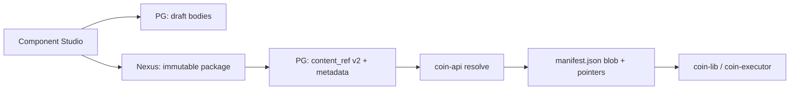

# Migration: gp_artifact_bodies dual-write → Nexus-only

**Audience:** Platform team  
**Scope:** local pilot → corp fleet  
**ADR:** [gp-component-package-model](../adr/gp-component-package-model.md) (Q1, deprecations)  
**Status:** plan accepted (GCP-5.1)

## Проблема

Сегодня артефакты GP content дублируются в двух местах:

| Хранилище | Когда пишется | Кто читает |
|-----------|---------------|------------|
| **Nexus** (gp-content package, manifest URLs) | `publish-content.sh`, Component Studio register | coin-executor, coin-lib resolve fallback |
| **`gp_artifact_bodies`** (PostgreSQL) | GP release draft/publish side-effects, embedded seed | Admin API artifact preview, legacy copy-on-publish |
| **`component_artifact_bodies`** | Component Studio draft only | validate/register, seed into `gp_artifact_bodies` |

Это усложняет SoT, увеличивает blast radius миграций и мешает UI-first модели: published content должен жить **только в Nexus**.

## Целевое состояние



| Слой | Draft | Published / canary |
|------|-------|---------------------|
| Authoring bodies | `component_artifact_bodies` | — |
| Package + digest | — | Nexus `package.manifest.json` + files |
| Registry | `component_versions` draft | `content_ref` v2, status `canary` / `published` |
| GP release snapshot | manifest blob в Nexus | manifest blob в Nexus |
| **`gp_artifact_bodies`** | **deprecated** | **removed** |

Embedded bytes (`coin-api/internal/gpcontent/seed/`) — **bootstrap only**, не SoT для новых releases.

## As-is: точки dual-write в коде

| Путь | Файл | Поведение |
|------|------|-----------|
| GP draft create | `store/gp_release.go` | `SeedArtifactsToRelease` (embedded) |
| GP resolve side-effect | `store/gp_resolve.go` | `seedGPArtifactsFromGPContent` → `gp_artifact_bodies` |
| GP resolve fallback | `store/gp_resolve.go` | `gpcontent.SeedArtifactsToRelease` (embedded go-app) |
| Migrate on startup | `migrate/migrate.go` | `gpcontent.SeedGoAppV100` |
| Copy on publish | `store/gp_resolve.go` | `copyArtifactsBetween` |
| Admin read | `store/artifacts.go`, `artifacts_admin.go` | `ListArtifactBodies` |

**Read path для product CI:** manifest `validateSchema` / `containerfile` URLs → Nexus (не PG bodies). PG bodies — legacy / admin convenience.

## Фазы миграции

### Phase A — local pilot (текущая, GCP-5)

**Цель:** зафиксировать план, не ломать E2E.

- [x] Component Studio + Nexus register для `branching-model`, `gp-content`
- [x] `content_ref` v2 + materializers в resolve
- [x] Документация enabling team ([control-plane.md](../control-plane.md), [golden-paths.md](../golden-paths.md))
- [ ] Embedded seed помечен deprecated в коде (остаётся для `make bootstrap` без seed-jenkins-lib)

**Acceptance:** `make seed-jenkins-lib` + `make e2e-build-engines` green; resolve manifest содержит Nexus URL для schema/containerfile.

### Phase B — stop new dual-write (post-corp gate)

**Цель:** новые GP releases не пишут в `gp_artifact_bodies`.

1. Удалить вызовы `seedGPArtifactsFromGPContent` / `SeedArtifactsToRelease` из `gp_resolve.go` и `gp_release.go`.
2. Admin artifact API для GP release → redirect: читать из Nexus gp-content package (по composition pin), не из PG.
3. `copyArtifactsBetween` — удалить или no-op.
4. Миграция данных не требуется для новых releases; старые rows остаются read-only.

**Gate:** platform lead sign-off; coin-ui GP detail не зависит от PG bodies.

**Rollback:** feature flag `COIN_GP_ARTIFACT_BODIES_WRITE=true` (временный) — только если блокер в corp.

### Phase C — remove embedded seed

**Цель:** убрать `//go:embed seed/…` из coin-api.

1. Local bootstrap: `make seed-jenkins-lib` обязателен (или one-shot import API).
2. Удалить `gpcontent/seed.go`, `seed_draft.go`, вызов из `migrate.go`.
3. Обновить onboarding docs.

**Acceptance:** fresh `make bootstrap && make seed-jenkins-lib` без embedded bytes.

### Phase D — drop `gp_artifact_bodies` (fleet)

**Цель:** удалить таблицу и admin endpoints.

1. SQL migration `DROP TABLE gp_artifact_bodies`.
2. Удалить `artifacts.go`, `artifacts_admin.go`, wipe scripts references.
3. Проверить scanner / analytics не читают таблицу.

**Gate:** corp fleet 0 dependencies на PG artifact bodies (audit query).

## `component_artifact_bodies` (Studio draft)

По Q1: **остаётся** для draft authoring в Component Studio. Published/canary versions не читают PG bodies на resolve path.

Отдельная фаза (optional): export draft → Nexus-only registry без PG bodies даже для draft — не в scope GCP-5.

## Проверки

```bash
# manifest refs указывают на Nexus, не на PG
curl -fsS "http://localhost:8090/v1/golden-paths/go-app/manifest?pin=%3D1.0.0" \
  -H "Authorization: Bearer ${COIN_API_TOKEN:-dev-local-token}" \
  | jq '.validateSchema.url, .lib.url'

# E2E после Phase B
cd docker && make e2e-build-engines
```

## Связанные документы

- [control-plane.md](../control-plane.md) — три слоя SoT, manifest
- [golden-paths.md](../golden-paths.md) — enabling team playbook
- [how-to/publish-gp-release.md](../how-to/publish-gp-release.md) — GP publish через Admin API
- [adr/gp-component-package-model.md](../adr/gp-component-package-model.md) — deprecations table
