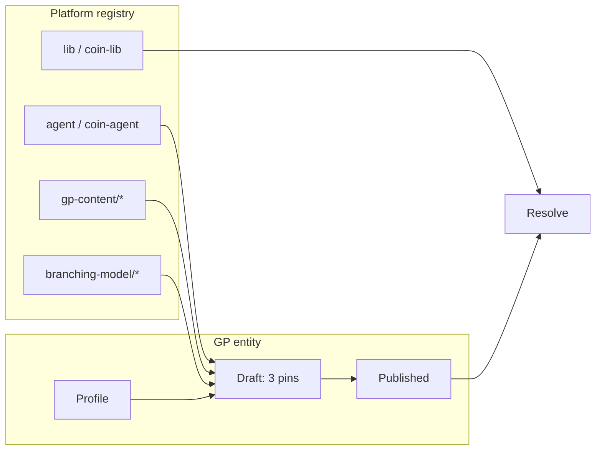

## Context

**Текущее состояние:**

- `gp_profiles.slots` — JSON с 5 bindings (agent, executor, lib, gp-content, branching-model).
- `CreateGPProfile` UI собирает версии компонентов, но после `coin-ui-gp-entity-hub` отправляет только slot names — версии теряются.
- GP hub показывает «Slots: 5», кнопки New draft + New release; direct publish через `/gp/:name/releases/new`.
- Resolve/manifest materialize все 5 pins из `gp_composition` per release.
- ADR [build-engine-contract.md](../../docs/adr/build-engine-contract.md): `coin-agent` содержит executor; lib — Jenkins glue ([coin-lib-scope](../../.cursor/rules/coin-lib-scope.mdc)).

**Зафиксированные product decisions (platform lead):**

| Решение | Значение |
|---------|----------|
| Profile metadata | `name` + optional `description` only |
| Profile ↔ build stack | **Нет связи** — gp-content фиксируется в composition **версии** GP, не в профиле |
| Composition | Только в draft; release только promote draft |
| GP draft pins (operator) | **3 catalog picks:** agent stack (`agent`), `branching-model`, `gp-content` |
| Platform runtime | **`lib` only** — Jenkins glue; agent stack выбирается в draft |
| UI direct publish | Убрать полностью |
| Catalog Slots column | Убрать |

## Goals / Non-Goals

**Goals:**

- Чёткое разделение: Profile (identity) → Draft (GP pins) → Release (promoted).
- Operator UI отражает ментальную модель enabling team без 5-slot noise.
- coin-api resolve корректно собирает manifest с platform runtime + GP composition.
- E2E `demo-go-app` green после миграции seed.

**Non-Goals:**

- Corp fleet rollout.
- Удаление HTTP API `publishGPRelease` (internal/bootstrap only).
- Рефакторинг component registry types (agent vs executor merge в registry).

## Decisions

### D1: Profile schema

```sql
gp_profiles (
  name        TEXT PRIMARY KEY,
  description TEXT NULL,
  created_at  TIMESTAMPTZ ...
)
-- DROP slots column (pilot: migration + seed refresh)
```

API `POST /v1/admin/golden-paths` body: `{ name, description?, actor? }` — без `slots`.

`GET .../profile` returns `{ name, description, createdAt }`.

### D2: GP composition (draft/release) — three catalog pins

Draft/release composition — **3 pins**, выбираемые publisher из **component registry** при создании draft. Имена компонентов **не привязаны** к имени GP profile.

**Три выбора в draft wizard (operator UI):**

| # | UI label | Registry type | Пример |
|---|----------|---------------|--------|
| 1 | Agent / executor (runtime stack) | `agent` | `coin-agent@1.0.0` |
| 2 | Branching model | `branching-model` | `trunk-based@1.0.0` |
| 3 | GP content (build stack) | `gp-content` | `go-app@1.0.0` |

**Agent + executor:** один picker на `agent` stack. `coin-agent` содержит `coin-executor` ([build-engine-contract](../../docs/adr/build-engine-contract.md)); отдельный picker `executor` в draft **не нужен** — resolve materialize `executor` section из agent bundle / paired metadata.

**Жизненный цикл:**



| Этап | Кто | Что |
|------|-----|-----|
| 1. Components | Platform team | Publish `agent`, `gp-content`, `branching-model` в registry |
| 2. Platform lib | Platform admin | Pin `lib` в `platform_settings.runtime` (default для всех GP) |
| 3. GP profile | Enabling team | `name` + `description` |
| 4. Draft | Publisher | Catalog: **agent** + **branching-model** + **gp-content** (name + version each) |
| 5. Release | Promote only | Immutable в Nexus |

**Composition map keys** (versions):

| Key | Type | Name field in API body |
|-----|------|------------------------|
| `agent` | `agent` | `agentStackName` (e.g. `coin-agent`) |
| `branching-model` | `branching-model` | `branchingModelName` |
| `gp-content` | `gp-content` | `gpContentName` |

**Request body example:**

```json
{
  "version": "1.0.0-snapshot.1",
  "agentStackName": "coin-agent",
  "gpContentName": "go-app",
  "branchingModelName": "trunk-based",
  "composition": {
    "agent": "1.0.0",
    "gp-content": "1.0.0",
    "branching-model": "1.0.0"
  }
}
```

- `agent`, `gp-content`, `branching-model` keys **обязательны** в новых drafts.
- Validation **rejects** `lib` и standalone `executor` в composition map (`lib` — platform runtime; `executor` — из agent stack).
- Profile name `xxx` может использовать `gpContentName: go-app` и любой published `agent` stack.

**Superseded:** 2-slot model (только gp-content + branching-model; agent из platform runtime) — заменён на 3-slot после UX review.

**Alternative rejected:** 5-slot draft UI — noise; lib остаётся platform-wide.

### D3: Platform runtime line (lib only)

**SoT:** `platform_settings.runtime` — **только `lib`** (Jenkins Shared Library glue). Agent stack и executor version задаются **per GP draft** (D2).

```json
{
  "runtime": {
    "lib": { "type": "lib", "name": "coin-lib", "version": "1.0.0" }
  }
}
```

Resolve **merges** GP draft composition (agent + gp-content + branching-model) + platform `lib` pin → full manifest.

`executor` в manifest — materialize из выбранного `agent` stack (не отдельный draft picker).

UI: редактирование **lib** — Platform settings; **agent** — draft wizard (Platform → Runtime catalog read-only для discovery).

**Superseded:** agent + executor + lib все в `platform_settings.runtime` (pilot §2).

**Alternative rejected:** lib per GP draft — Jenkins `@Library` semver fleet-wide.

### D4: Operator publish flow

```
/gp/new                    → create profile (name, description)
/gp/:name                  → hub; CTA «New draft» only
/gp/:name/releases/new-draft → composition picker: **agent stack** + **branching-model** + **gp-content** (catalog, name + version each)
promote on release detail  → published release
```

Remove: `/gp/:name/releases/new`, hub «New release», welcome banner «Publish initial release», PublishWizard `lockedTab=publish`.

Legacy `/releases/publish` → redirect to `/gp/:name/releases/new-draft`.

### D5: Catalog columns

| Column | Source |
|--------|--------|
| Profile | `name` |
| Description | truncated `description` |
| Latest stable | `catalog.latest` |
| Latest canary | `catalog.latestCanary` |
| Releases | count published (+ draft badge) |

No Slots column.

### D6: Overview tab

- Show profile description, policy summary, release status.
- No «composition slots» table from profile (profile has no slots).
- Empty state: «No drafts or releases» + CTA New draft.

### D7: Migration (local pilot)

1. SQL migration: add `description`, drop `slots`.
2. Re-seed GP profiles via bootstrap (`make seed` / `wipe-gp` + E2E bootstrap).
3. Existing 5-slot releases: either re-created via draft or one-off migration script copying gp-content + branching-model pins only (pilot: prefer wipe + seed).

### D8: Draft wizard UX (three catalog pickers)

| Slot | UI control |
|------|------------|
| Agent / executor | Dropdown **agent** component name + **published version** (e.g. `coin-agent`) |
| Branching model | Dropdown model name + published version |
| GP content | Dropdown stack name + published version |

- Prefill из latest draft/release composition, если есть.
- Platform runtime banner — только для **lib** misconfiguration.

**Superseded:** 2-picker draft wizard (§7 implementation); hub **Build stack** tab (§7.4) — см. D10.

### D11: Draft wizard form layout

Форма **New draft** / **Edit draft composition** — табличная сетка с выровненными колонками:

| Колонка | Содержание |
|---------|------------|
| Slot | `agent` / `gp-content` / `branching-model` (mono) |
| Component | Label + dropdown имени компонента |
| Version | Label + dropdown published version |

- Заголовки колонок видны на `sm+`.
- Component и Version — **одинаковая высота** полей; label над каждым select, не inline с slot key.
- На узком экране — stack, но порядок slot → component → version сохраняется.

**Проблема (pilot):** inline label+select в средней колонке grid ломает вертикальное выравнивание version dropdown (см. screenshot §11).

### D12: Draft mutable until promote

**Правило:** GP version со `status = draft` — **mutable** workspace для composition (3 pins). Published — **immutable**.

| Статус | Composition | Delete | Promote |
|--------|-------------|--------|---------|
| `draft` | **Edit** (PATCH) + Save в UI | ✅ | ✅ |
| `published` | Read-only | ❌ 409 | — |

```
PATCH /v1/admin/golden-paths/{name}/versions/{version}
  → 200 только если status = draft
  → 409 если published
  Body: agentStackName, gpContentName, branchingModelName, composition (как create draft)
```

- Версия snapshot (`1.0.0-snapshot.N`) **не меняется** при edit composition — меняются только pins.
- Audit: `update_gp_draft`.
- UI: release detail для draft — editable composition (те же 3 pickers) + **Save**; published — таблица read-only без Save/Delete.

**Alternative rejected:** новый draft при каждом изменении pins — теряет смысл draft как редактируемого workspace.

### D10: No profile ↔ build-stack link

**Правило:** GP profile — identity only (`name`, `description`). Связи **profile → build stack (gp-content)** не существует.

| Сущность | Где живёт gp-content |
|----------|----------------------|
| Component registry | Platform → Build stacks (`/platform/build-stacks`) |
| GP version (draft/release) | `gp_composition` pin: `gp-content/{name}@{version}` |
| GP profile | **Нет** — профиль не «владеет» build stack |

- Разные версии одного GP **могут** pin разные gp-content (смена stack в новом draft).
- Operator смотрит pinned gp-content на **release detail** (таблица Composition), не на отдельной вкладке профиля.
- Deep link в Studio / Platform catalog — из composition row (`gp-content` → `/studio/gp-content/{name}/{version}`), не из hub tab.

**UI change:** убрать вкладку **Build stack** с GP hub (`/gp/:name/build-stack`). Остаётся Platform → Build stacks для каталога компонентов.

**Superseded:** `coin-ui-enabling-ia` / `gp-entity-hub` — Build stack tab как primary path к gp-content профиля.

### D9: Draft deletion (published immutable)

**Правило:** GP release со `status = draft` MAY быть удалён operator/publisher. GP release со `status = published` MUST NOT удаляться через operator UI/API — immutable после promote (manifest blob в Nexus, catalog pointers).

```
DELETE /v1/admin/golden-paths/{name}/versions/{version}
  → 204 только если status = draft
  → 409 Conflict если status = published (или canary-only intermediate, если появится)
```

**Scope удаления draft (pilot):**

- Строки `gp_releases`, `gp_composition`, `gp_artifact_bodies` (если есть) для этого draft — cascade в PG.
- Nexus: draft до promote **не** публикует GP manifest blob; удаление не трогает Nexus.
- Audit: `delete_gp_draft` с `entity_key` `{name}@{version}`.

**UI:**

- Кнопка **Delete draft** на release detail и в Releases tab — только для `status = draft`.
- Published release detail — без delete; copy «Published releases are immutable».

**Alternative rejected:** soft-delete / tombstone для published — усложняет resolve и fleet; deprecate policy отдельно.

## Risks / Trade-offs

| Risk | Mitigation |
|------|------------|
| BREAKING API for create profile | OpenAPI bump; update coin-ui only consumer |
| Legacy 5-slot releases in DB | Read path supports old composition; new drafts 2-slot only |
| Platform runtime not set | Resolve fails with clear error; seed sets defaults |
| gp-content name ≠ profile name | Document in golden-paths; E2E uses explicit `gpContentName` in seed |
| PublishWizard scoped bug | Fix `gpNames.length` check when `scopedGpName` set |
| Mis-implementation: profile name = gp-content name | Follow-up tasks §7; API field `gpContentName` |
| Orphan drafts clutter hub | §8: delete draft API + UI |

## Migration Plan

1. coin-api migration + resolve changes + tests
2. Update docker seed / bootstrap scripts
3. coin-ui forms + hub + remove direct publish routes
4. **Follow-up:** catalog decoupling (`gpContentName`, UI pickers) — §7 tasks
5. **Follow-up:** three-pin draft (agent + branching + gp-content) — §9 tasks
6. **Follow-up:** draft deletion — §8 tasks
6. `demo-go-app` E2E green
7. Update `docs/golden-paths.md` composition section

Rollback: revert migration in dev via `make wipe-gp` + previous image tags.

## Open Questions

| # | Вопрос | Статус | Lean |
|---|--------|--------|------|
| Q1 | Platform runtime SoT — `platform_settings.runtime` vs отдельная таблица | ⏳ | Extend `platform_settings` JSON (pilot) |
| Q2 | Legacy 5-slot published releases — migrate or hard cut wipe | ⏳ | Hard cut + re-seed (local pilot) |
| Q3 | `executor` pin в manifest при agent-stack merge | ⏳ | Resolve injects executor version from platform line (manifest section unchanged for executor) |
| Q4 | Per-GP agent stack в draft UI | ✅ | **Да** — 3-й picker; executor из agent bundle |
| Q5 | `gpContentName` в API vs nested composition object | ✅ | Symmetric с `branchingModelName`, `agentStackName` |
| Q6 | Удаление published GP release | ✅ | **Запрещено** — только draft; Nexus immutable |
| Q7 | Executor отдельный picker vs bundled в agent | ✅ | **Bundled** — один picker agent/executor stack |
| Q8 | Build stack tab на GP hub | ✅ | **Убрать** — gp-content только в composition версии; каталог — Platform |
| Q9 | Edit composition в draft | ✅ | **Да** — PATCH draft; published read-only |
| Q10 | Layout draft wizard | ✅ | Таблица Slot / Component / Version |
